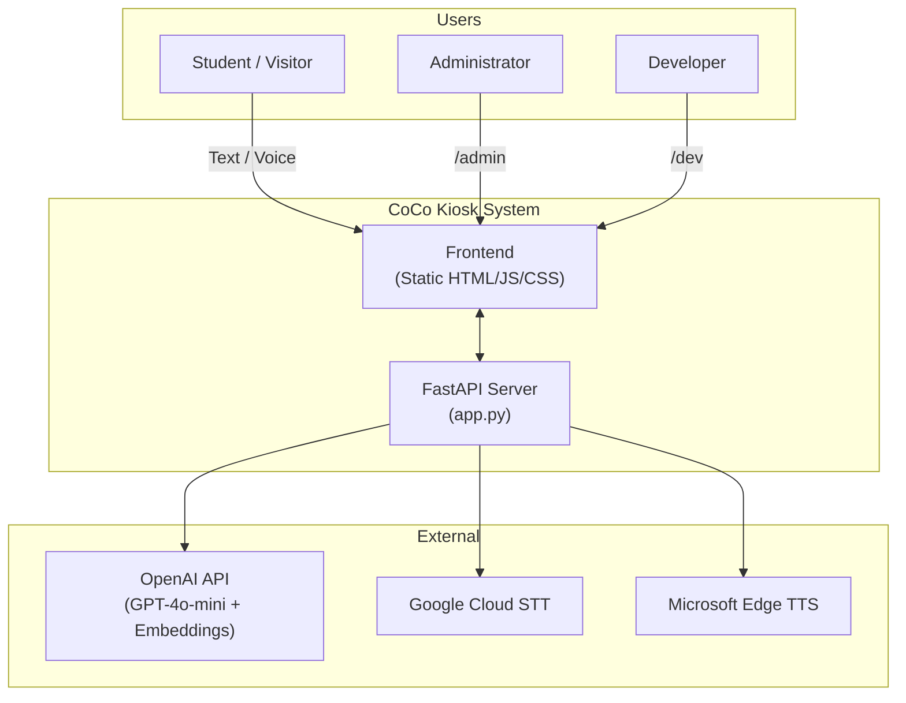
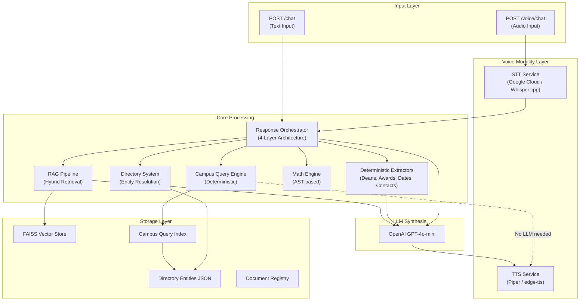
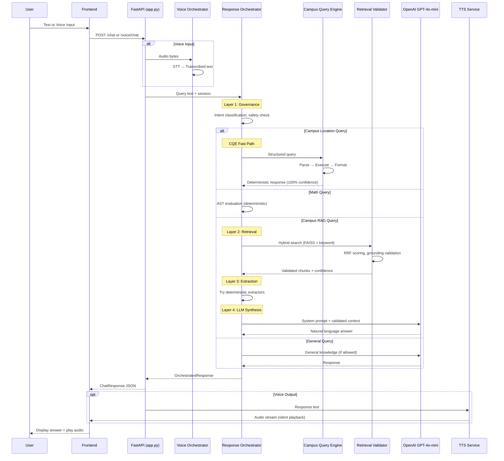
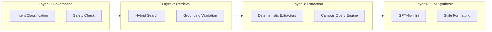
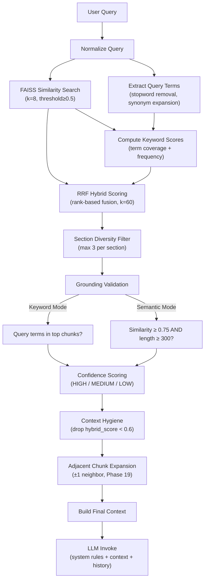
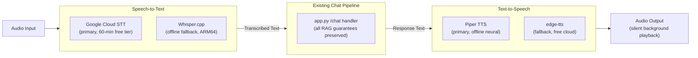
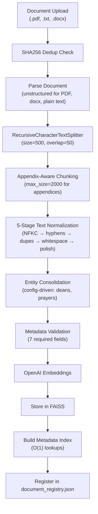

# Architecture Overview
This document serves as a critical, living reference designed to equip developers and agents with a rapid and comprehensive understanding of CoCo's codebase architecture, enabling efficient navigation and effective contribution from day one. Update this document as the codebase evolves.

## 1. Project Structure

This section provides a high-level overview of the project's directory and file structure, categorised by architectural layer or major functional area.

```
vibecoding_coco/                          # Repository Root
├── campus_rag_chatbot/                   # Core application package (all backend + frontend)
│   ├── app.py                            # FastAPI server — primary entrypoint, routing, handlers
│   ├── main.py                           # Core RAG/chat logic (legacy, partially superceded by orchestrator)
│   ├── response_orchestrator.py          # Phase 44: 4-layer LLM-as-Final-Synthesizer orchestration
│   ├── document_manager.py              # Document ingestion, chunking, FAISS storage pipeline
│   ├── retrieval_validator.py           # Hybrid retrieval, grounding validation, RRF scoring
│   ├── confidence_scorer.py             # Confidence scoring (HIGH / MEDIUM / LOW)
│   ├── intent_classifier.py             # Query intent classification (directory, academic, etc.)
│   ├── response_formatter.py            # Structured answer formatting for frontend
│   ├── query_analyzer.py               # Phase 45: Query type detection for response style
│   ├── input_preprocessor.py           # Phase 46: STT artifact cleanup, number normalization
│   ├── math_engine.py                  # Phase 46: Deterministic arithmetic evaluation (AST-based)
│   │
│   ├── # --- Campus Query Engine (CQE) — Phases 47–53 ---
│   ├── campus_schema.py                 # Hierarchical data model (Campus → Building → Floor → Room)
│   ├── campus_index.py                  # CampusQueryIndex — O(1) lookups via pre-built indexes
│   ├── campus_query_parser.py           # Unified query parser with filter extraction
│   ├── campus_query_executor.py         # Index-based query execution, structural proximity
│   ├── campus_response_formatter.py     # Template-based response formatting (no LLM)
│   ├── structured_query.py              # StructuredQuery, QueryIntent, QueryFilter dataclasses
│   ├── migrate_entities.py              # Entity migration validation script
│   │
│   ├── # --- Directory System ---
│   ├── entity_registry.py               # Directory entity definitions & storage
│   ├── entity_manager.py               # Phase 55: Admin entity management with validation
│   ├── entity_resolver.py              # Entity resolution pipeline
│   ├── entity_analyzer.py              # Entity analysis utilities
│   │
│   ├── # --- Text Processing ---
│   ├── text_normalizer.py               # Text normalization for directory queries
│   ├── text_normalizer_pipeline.py      # Phase 18.1: 5-stage PDF artifact cleanup pipeline
│   ├── consolidation_engine.py          # Phase 24: Config-driven entity consolidation
│   ├── entity_consolidation.py          # DEPRECATED — use consolidation_engine.py
│   ├── metadata_index.py               # Phase 25: O(1) chunk lookups by metadata fields
│   │
│   ├── # --- Deterministic Extractors ---
│   ├── entity_extractors/               # Phase 18.2/27/31: Rule-based entity extraction
│   │   ├── __init__.py
│   │   ├── deans.py                     # Dean enumeration extraction
│   │   ├── awards.py                    # Awards enumeration extraction
│   │   ├── dates.py                     # Event date/time extraction
│   │   └── contacts.py                  # Office contact extraction
│   │
│   ├── # --- Voice Subsystem — Phases 32–42 ---
│   ├── voice/                           # Voice integration package
│   │   ├── __init__.py
│   │   ├── config.py                    # Voice configuration management
│   │   ├── stt_service.py              # Speech-to-Text service with fallback
│   │   ├── tts_service.py              # Text-to-Speech service with text optimization
│   │   ├── voice_orchestrator.py        # STT → Chat → TTS coordination
│   │   ├── audio_utils.py              # Audio format conversion & validation
│   │   ├── provider_registry.py         # Phase 35: Available STT/TTS providers & settings
│   │   ├── usage_tracker.py            # Phase 38: Google STT 60-min quota tracking
│   │   └── engines/                     # Engine implementations
│   │       ├── whisper_cpp.py           # Offline STT — Whisper.cpp (ARM64 optimized)
│   │       ├── whisper_openai.py        # Cloud STT fallback — OpenAI Whisper API
│   │       ├── google_cloud_stt.py      # Cloud STT — Google Speech-to-Text
│   │       ├── piper_tts.py            # Offline TTS — Piper neural network voices
│   │       └── edge_tts.py             # Cloud TTS — Microsoft Edge (free, no key)
│   ├── voice_routes.py                  # Voice API endpoints (/voice/*)
│   │
│   ├── # --- Security & Admin ---
│   ├── credential_manager.py            # Phase 39: AES-256-GCM encrypted credential storage
│   ├── admin.py                         # CLI admin interface
│   │
│   ├── # --- Observability ---
│   ├── event_tracker.py                 # Phase 16: Structured event logging (privacy-safe)
│   ├── query_logger.py                 # Query logging & analytics
│   │
│   ├── # --- Frontend ---
│   ├── static/                          # Static HTML/CSS/JS served by FastAPI
│   │   ├── index.html                   # Kiosk chat UI
│   │   ├── app.js                       # Chat logic, voice UI, debug panel
│   │   ├── style.css                    # Kiosk styles
│   │   ├── admin.html                   # Admin dashboard
│   │   ├── admin.js                     # Admin logic (entity CRUD, voice config, analytics)
│   │   ├── admin.css                    # Admin styles
│   │   ├── dev.html                     # Developer tools page
│   │   ├── dev.js                       # Developer mode toggle (RAG-only)
│   │   ├── login.html                   # Admin login page
│   │   └── login.css                    # Login styles
│   │
│   ├── # --- Data & Storage ---
│   ├── data/                            # Runtime data directory
│   │   ├── directory_entities.json      # Directory location entities (220+ rooms)
│   │   ├── consolidation_rules.json     # Config-driven consolidation rules
│   │   ├── metadata_index.json          # Auto-generated chunk metadata index
│   │   ├── voice_settings.json          # Persisted voice provider configuration
│   │   ├── debug_settings.json          # Debug panel enable/disable state
│   │   ├── credentials.enc              # AES-256-GCM encrypted cloud credentials
│   │   ├── stt_usage.json              # Google STT usage tracking
│   │   └── document_registry.json       # Ingested document metadata
│   ├── vector_store/                    # FAISS vector database (persisted)
│   ├── documents_to_ingest/            # Document upload staging area
│   ├── logs/                            # Application logs
│   │
│   ├── # --- Configuration ---
│   ├── .env                             # Environment variables (API keys, paths)
│   ├── requirements.txt                # Python dependencies
│   └── requirements_py311.txt          # Python 3.11 dependencies (primary)
│
├── # --- Development & Deployment Tooling ---
├── scripts/                             # Utility scripts (debugging, testing, maintenance)
├── reports/                             # Analysis logs, validation reports
├── tests/                               # Integration / E2E tests
├── question_generator/                  # Synthetic Q&A generation for testing
├── ui_design/                           # Kiosk UI sandbox for design iteration
├── whisper.cpp/                         # External: offline STT engine (ARM64)
├── images/                              # Project images/assets
│
├── # --- Setup & Deployment ---
├── pi-setup.sh                          # Raspberry Pi 5 setup script (primary target)
├── win-setup.ps1                        # Windows setup script (development/testing)
├── WINDOWS_SETUP_INSTRUCTIONS.txt      # Windows setup guide
├── RPI5_DEPLOYMENT_INSTRUCTIONS.txt    # RPi5 deployment guide
├── DEPLOYMENT.md                        # General deployment documentation
│
├── # --- Project Documentation ---
├── PROJECT_CONTEXT.md                   # Comprehensive project context & phase history
├── CLAUDE.md                            # Agent onboarding reference
├── architecture_template.md            # Template for this document
└── architecture.md                      # This document
```

## 2. High-Level System Diagram

### System Context



### Internal Component Architecture



### Request Processing Flow



## 3. Core Components

### 3.1. Frontend

**Name:** CoCo Kiosk Web Interface

**Description:** A static HTML/CSS/JS frontend optimized for kiosk-style deployment. Provides three interfaces: (1) the main chat UI for students/visitors with voice support, (2) an admin dashboard for document/entity management and analytics, and (3) a developer tools page for RAG debugging. The chat UI renders `structured_answer.full_answer` directly for kiosk readability, displays confidence badges and source citations, and supports touch-friendly voice interaction with a 70px circular mic button.

**Technologies:** HTML5, CSS3, Vanilla JavaScript, MediaRecorder API (voice recording), Web Audio API (waveform visualization), Fullscreen API (kiosk mode)

**Deployment:** Served directly by FastAPI's `StaticFiles` mount — no build step required. Functional on Chromium-based kiosk browsers (Raspberry Pi) and desktop browsers.

**Key Pages:**

| Page | Path | Purpose |
|------|------|---------|
| Chat UI | `/` (`index.html`) | Student/visitor kiosk interface with voice |
| Admin Dashboard | `/admin` (`admin.html`) | Document/entity management, analytics, voice config |
| Developer Tools | `/dev` (`dev.html`) | RAG-only mode toggle, debug controls |
| Admin Login | `/login` (`login.html`) | Authentication gate for admin access |

### 3.2. Backend Services

The backend is a **monolithic FastAPI application** — all services run within a single process. This is intentional for the target deployment environment (Raspberry Pi 5) where resource constraints make microservice architectures impractical.

#### 3.2.1. FastAPI Server (`app.py`)

**Name:** Campus Information Kiosk API

**Description:** The primary entrypoint and routing hub. Handles all HTTP endpoints, request validation, session management, admin authentication, and coordinates between subsystems. At 4,700+ lines, this is the largest module and acts as the integration backbone.

**Technologies:** Python 3.11, FastAPI, Uvicorn, Pydantic (request/response models)

**Key Endpoints:**

| Endpoint | Method | Purpose |
|----------|--------|---------|
| `/chat` | POST | Submit text query → get structured answer |
| `/feedback` | POST | User feedback submission |
| `/admin/*` | Various | Document/entity CRUD, analytics, voice config |
| `/dev/*` | Various | RAG-only mode toggle, debug settings |
| `/voice/*` | Various | Voice API (see Voice Subsystem) |

**Deployment:** Uvicorn ASGI server, default port 8000

#### 3.2.2. Response Orchestrator (`response_orchestrator.py`)

**Name:** LLM-as-Final-Synthesizer (Phase 44)

**Description:** Unified 4-layer response orchestration where all response paths converge. Determines the appropriate response strategy and routes through governance, retrieval, extraction, and LLM synthesis layers. The only exception is the CQE fast path, which returns deterministic responses without LLM involvement.

**Architecture:**



**Response Modes:**

| Mode | Trigger | LLM Used? |
|------|---------|-----------|
| `STRUCTURED_AUTHORITATIVE` | Campus location queries (CQE) | No |
| `EXTRACTOR_AUTHORITATIVE` | Enumeration queries (deans, awards, etc.) | Yes (synthesis only) |
| `RAG_AUTHORITATIVE` | High-confidence campus document queries | Yes |
| `RAG_SUPPLEMENTED` | Low-semantic-relevance campus queries | Yes |
| `GENERAL_KNOWLEDGE` | Non-campus queries (if allowed) | Yes |

#### 3.2.3. Campus Query Engine (CQE) — Phases 47–53

**Name:** Deterministic Structured Campus Query Engine

**Description:** Handles ALL location/directory queries with 100% deterministic responses. No LLM is involved for location facts — responses are generated entirely from pre-built indexes and templates. Thesis position: *"Deterministic Structured Campus Query Engine with Controlled Generative Augmentation."*

**Components:**

| File | Role |
|------|------|
| `campus_schema.py` | Hierarchical data model: Campus → Building → Floor → Room + OutdoorLocation |
| `campus_index.py` | `CampusQueryIndex` with O(1) lookups via pre-built relationship indexes |
| `campus_query_parser.py` | Unified query parser: pattern matching → `StructuredQuery` |
| `campus_query_executor.py` | Index-based execution with structural proximity (NEAREST) |
| `campus_response_formatter.py` | Template-based natural language formatting |
| `structured_query.py` | Dataclasses: `StructuredQuery`, `QueryIntent`, `QueryFilter` |

**Query Intents:**

| Intent | Example | Execution Method |
|--------|---------|-----------------|
| `LOCATE_SINGLE` | "Where is the library?" | Alias/ID O(1) lookup |
| `LOCATE_MULTIPLE` | "Show all classrooms" | Filter intersection |
| `NEAREST` | "Nearest restroom to SP303" | 4-tier structural proximity |
| `COUNT` | "How many offices?" | Aggregation |
| `LIST` | "List all buildings" | Entity enumeration |

**Structural Proximity Algorithm (NEAREST):**

| Tier | Scope | Priority |
|------|-------|----------|
| 0 | Same Floor | Highest |
| 1 | Same Building, different floor | High |
| 2 | Same Campus, different building | Medium |
| 3 | Different Campus | Lowest |

**Index Scale:** 220+ rooms, 12 buildings, 2 campuses, with outdoor locations

#### 3.2.4. RAG Retrieval Pipeline

**Name:** Hybrid RAG Pipeline (Phases 17A–29)

**Description:** The document-based retrieval system combining vector similarity search with keyword matching. This is a **Hybrid RAG** architecture using Reciprocal Rank Fusion (RRF) for score combination — not a Naive, Agentic, or Graph RAG.

**RAG Architecture Type: Hybrid RAG (Vector + BM25 via RRF)**

**Pipeline Steps:**



**Key Configuration:**

| Parameter | Value | Purpose |
|-----------|-------|---------|
| `RETRIEVAL_TOP_K` | 8 | Number of chunks to retrieve |
| `RELEVANCE_SCORE_THRESHOLD` | 0.5 | Minimum vector similarity |
| `MIN_HYBRID_SCORE_FOR_CONTEXT` | 0.6 | Minimum hybrid score for inclusion |
| `HYBRID_SCORING_METHOD` | `"rrf"` | Reciprocal Rank Fusion |
| `RRF_K` | 60 | Smoothing constant (industry standard) |
| `SEMANTIC_SIMILARITY_THRESHOLD` | 0.75 | Semantic grounding override threshold |
| `MIN_SEMANTIC_CONTENT_LENGTH` | 300 | Minimum chars for semantic override |
| `MAX_CHUNKS_PER_SECTION` | 3 | Section diversity limit |

#### 3.2.5. Voice Subsystem (Phases 32–42)

**Name:** Voice Modality Layer

**Description:** Voice is strictly a **modality layer** — not a decision layer. All RAG guarantees, grounding rules, and confidence gating are preserved identically whether input arrives as text or voice. The subsystem coordinates STT → Chat Pipeline → TTS with automatic engine fallback.

**Architecture:**



**Voice API Endpoints:**

| Endpoint | Method | Rate Limit | Purpose |
|----------|--------|------------|---------|
| `/voice/status` | GET | — | Service availability status |
| `/voice/transcribe` | POST | 30/min | Audio → text only |
| `/voice/synthesize` | POST | 60/min | Text → audio only |
| `/voice/chat` | POST | 20/min | Full voice-to-voice flow |
| `/voice/health` | GET | — | Component-level health check |
| `/voice/stream` | WebSocket | — | Streaming transcription |

**STT Processing Flow:**

```
Audio (WebM/MP4) → Format Detection → 16-bit PCM WAV Conversion → STT Engine → 
Confidence Check → (if low) Text Fallback Prompt → Transcribed Text → 
Input Preprocessor (STT artifact cleanup) → Chat Pipeline
```

**TTS Output Flow:**

```
Response Text → Text Optimization → TTS Engine → WAV Audio → 
Background Playback (no overlay) → Auto-stop on user interaction (implicit interruption)
```

#### 3.2.6. Deterministic Extractors (Phases 18.2, 27, 31)

**Name:** Rule-Based Entity Extraction Pipeline

**Description:** Bypasses LLM for enumeration queries to achieve 100% accuracy with no variability. Each extractor follows a three-layer architecture: Intent Detection → Regex Extraction → Formatted Output.

| Extractor | File | Detects | Example Query |
|-----------|------|---------|---------------|
| Deans | `entity_extractors/deans.py` | Dean enumeration queries | "Who are the deans?" |
| Awards | `entity_extractors/awards.py` | Awards/honors queries | "What are the awards?" |
| Dates | `entity_extractors/dates.py` | Event schedule queries | "When is enrollment?" |
| Contacts | `entity_extractors/contacts.py` | Office location queries | "Where is the registrar's office?" |

#### 3.2.7. Math Engine (Phase 46)

**Name:** Deterministic Arithmetic Processor

**Description:** Handles mathematical queries without LLM. Uses Python's `ast` module for secure evaluation (no `eval()`). Includes input preprocessing for STT artifacts (e.g., "five thousand" → "5000").

**Supports:** `+`, `-`, `*`, `/`, `**`, parentheses, word operators (`plus`, `times`, `divided by`)

#### 3.2.8. Document Ingestion Pipeline

**Name:** Document Management System (`document_manager.py`)

**Description:** Handles document ingestion from upload through chunking, normalization, consolidation, and FAISS indexing. Supports PDF (layout-aware via `unstructured`), TXT, and DOCX formats.

**Ingestion Flow:**



**Consolidation Engine:** Config-driven via `data/consolidation_rules.json`. Two pattern types:
- **Semantic**: Groups chunks containing related entities (e.g., deans)
- **Anchor-Continuation**: Finds anchor text and collects continuation chunks (e.g., prayers)

## 4. Data Stores

### 4.1. FAISS Vector Store

**Name:** Campus Document Vector Database

**Type:** FAISS (Facebook AI Similarity Search) — local, file-persisted

**Purpose:** Stores embedded document chunks for similarity search during retrieval.

**Location:** `campus_rag_chatbot/vector_store/`

**Key Details:**
- Embedding model: OpenAI `text-embedding-ada-002`
- Chunk count: ~749 chunks (varies with ingested documents)
- Includes synthetic chunks (consolidated entities) and appendix chunks

### 4.2. Directory Entities Store

**Name:** Campus Directory Entity Database

**Type:** JSON file (`data/directory_entities.json`)

**Purpose:** Stores all location entities (rooms, offices, facilities) with structured metadata. Source of truth for the Campus Query Engine and legacy directory system.

**Key Schema Fields:**
- `entity_id`, `canonical_name`, `aliases`
- `building`, `floor`, `room`
- `campus`, `department`
- `landmarks`, `description`
- `status` (active/inactive), `last_updated`
- `tags` (Phase 51), `primary_type` (Phase 51)

**Scale:** 220+ rooms, 12 buildings, 2 campuses, outdoor locations

### 4.3. Metadata Index

**Name:** Chunk Metadata Lookup Index

**Type:** JSON file (`data/metadata_index.json`, auto-generated)

**Purpose:** Enables O(1) chunk lookups by `chunk_id`, `section`, `section_title`, `page`, and `document`. Eliminates O(n) docstore iteration for adjacent chunk expansion.

### 4.4. Document Registry

**Name:** Ingested Document Registry

**Type:** JSON file (`document_registry.json`)

**Purpose:** Tracks metadata for ingested documents — SHA256 hash (deduplication), filename, chunk count, ingestion timestamp. Prevents duplicate ingestion.

### 4.5. Encrypted Credential Store

**Name:** Cloud Credential Vault

**Type:** AES-256-GCM encrypted binary file (`data/credentials.enc`)

**Purpose:** Stores cloud API keys (OpenAI, Google Cloud) encrypted at rest. Keys are derived via PBKDF2. Credentials can be managed through the Admin UI without SSH access.

### 4.6. Voice Configuration Stores

| File | Purpose |
|------|---------|
| `data/voice_settings.json` | Active STT/TTS provider selection (persisted) |
| `data/stt_usage.json` | Google Cloud STT monthly usage tracking (60-min quota) |
| `data/debug_settings.json` | Debug panel visibility toggle |

## 5. External Integrations / APIs

| Service | Purpose | Integration Method | Required |
|---------|---------|-------------------|----------|
| **OpenAI GPT-4o-mini** | LLM for response synthesis | REST API via LangChain `ChatOpenAI` | Yes |
| **OpenAI Embeddings** | Document chunk embedding (`text-embedding-ada-002`) | REST API via LangChain | Yes |
| **Google Cloud STT** | Primary speech-to-text (60-min free tier) | `google-cloud-speech` SDK | Optional |
| **Microsoft Edge TTS** | Free cloud text-to-speech | `edge-tts` Python package | Optional |

**Offline Engines (no API required):**

| Engine | Purpose | Notes |
|--------|---------|-------|
| **Whisper.cpp** | Offline STT (ARM64 optimized) | Requires separate model download |
| **Piper TTS** | Offline neural TTS | Requires Python 3.11, separate model download |
| **espeak-ng** | Fast fallback TTS | System dependency on RPi |

## 6. Deployment & Infrastructure

**Cloud Provider:** On-premise / edge deployment (no cloud hosting)

**Primary Target:** Raspberry Pi 5 (ARM64, Raspberry Pi OS)

**Secondary Target:** Windows 10/11 (development and testing)

| Platform | Setup Script | Python | Notes |
|----------|-------------|--------|-------|
| Raspberry Pi 5 | `pi-setup.sh` | 3.11 | Primary deployment, offline-first |
| Windows | `win-setup.ps1` | 3.11 | Development/testing environment |

**Requirements:**
- Python 3.11 (mandatory for Piper TTS — Python 3.13 incompatible due to `espeakbridge`)
- Virtual environment: `venv311/`
- Dependencies: `requirements_py311.txt`

**Key Services Used:**
- FastAPI + Uvicorn (application server, port 8000)
- FAISS (local vector store, no external database)
- File-based persistence (JSON, encrypted files)

**CI/CD Pipeline:** None currently configured. Manual deployment via setup scripts.

**Monitoring & Logging:**
- `EventTracker` (`event_tracker.py`): Structured event logging (privacy-safe, metadata only)
- `QueryLogger` (`query_logger.py`): Per-query logging with rotation
- Debug Panel (Phase 39B): Real-time per-request diagnostics (admin-toggled)
- `/admin/analytics`: Admin analytics dashboard
- Rolling log limits prevent unbounded disk growth

### Debugging & Observability Panels

**Provider Panel (`/admin` → Voice Configuration):**
- Visual provider cards showing engine status (online/offline)
- Pricing badges (FREE/PAID) on all providers
- Selectability rules (non-operational engines shown but disabled)
- Fallback chain configuration
- Usage quota display (Google STT: 60-min/month)

**Debug/Timing Panel (Phase 39B):**
- Admin-toggled via Developer section
- Per-response metadata:
  - LLM model used (`gpt-4o-mini`)
  - Retrieval mode (`campus`, `general`, `structured`)
  - Routing path (`rag:hybrid`, `cqe:structured`, `extractor:deans`)
  - Chunks retrieved count
  - Grounding status and mode (`keyword` / `semantic`)
  - Matched query terms
  - Timing breakdown (ms): retrieval, grounding, LLM, total
  - STT/TTS engine info (for voice requests)
  - Extractor used (if applicable)

## 7. Security Considerations

**Authentication:**
- Admin access: Session-based with `ADMIN_PASSWORD` environment variable
- Admin sessions: 8-hour duration, token-based
- API key: `ADMIN_API_KEY` for programmatic admin access

**Authorization:**
- Role-based: Admin endpoints require valid session token
- Developer endpoints accessible with admin auth
- Public chat endpoints are open (kiosk usage pattern)

**Data Encryption:**
- Cloud credentials: AES-256-GCM encryption at rest (`credential_manager.py`)
- Key derivation: PBKDF2 from machine-specific data
- Atomic file writes for crash safety
- Credentials never logged

**Voice Security:**
- Audio file validation with magic byte format detection
- Injection prevention checks on uploaded audio
- File size limits enforced
- Temporary audio storage with 5-minute TTL auto-cleanup

**API Safety:**
- Rate limiting per IP on voice endpoints
- Text length validation (TTS: max 10,000 characters)
- Input preprocessing strips potentially harmful patterns
- System prompt enforces "answer only from provided context"

## 8. Development & Testing Environment

**Local Setup Instructions:**

```bash
# 1. Clone repository
# 2. Create Python 3.11 virtual environment
python3.11 -m venv venv311

# 3. Activate and install dependencies
# Windows:
venv311\Scripts\activate
# RPi/Linux:
source venv311/bin/activate

cd campus_rag_chatbot
pip install -r requirements_py311.txt

# 4. Configure environment
cp .env.example .env
# Edit .env with: OPENAI_API_KEY, ADMIN_API_KEY, ADMIN_PASSWORD

# 5. Run
python app.py
# → http://localhost:8000/
```

**See also:** `WINDOWS_SETUP_INSTRUCTIONS.txt`, `RPI5_DEPLOYMENT_INSTRUCTIONS.txt`

**Testing Frameworks:**
- Golden test suite: `test_cqe_golden.py` (41 CQE tests)
- Campus query engine tests: `test_campus_query_engine.py`
- Voice API tests: `tests/test_voice_api.py`
- RAG acceptance tests: 32 test cases (golden query/response pairs)
- Question generator: `question_generator/` (synthetic Q&A for coverage)

**Code Quality Tools:**
- Python type hints used throughout
- Pydantic models for request/response validation
- Structured logging with the `logging` module
- No linter or formatter configuration currently in the repository

## 9. Future Considerations / Roadmap

**Known Limitations / Technical Debt:**
- `app.py` is 4,700+ lines — the monolithic routing module would benefit from decomposition into separate route modules (chat, admin, dev, entity management)
- `entity_consolidation.py` is deprecated but still present for backward compatibility
- 3–4 RAG golden tests experience intermittent LLM variability failures (prayer/motto content)
- 404 "General Information" section warnings from PDF parsing gaps
- Python 3.13 not supported due to Piper TTS `espeakbridge` incompatibility
- No CI/CD pipeline configured
- No formal linting or code formatting enforcement
- Cloud providers require manual credential configuration via Admin UI

**Potential Future Work:**
- Kiosk hardening (RPi5 optimization, crash recovery, watchdog)
- Multilingual support (Filipino language)
- Multi-document namespace support
- Observability dashboard enhancement
- Event-driven architecture for real-time updates
- `app.py` modularization into FastAPI sub-routers

## 10. Project Identification

**Project Name:** CoCo (Columban College Information Kiosk)

**Repository URL:** [Kiruzato/coco-kiosk](https://github.com/Kiruzato/coco-kiosk)

**Primary Contact/Team:** CoCo Development Team

**Date of Last Update:** 2026-02-13

## 11. Glossary / Acronyms

| Term | Definition |
|------|-----------|
| **CoCo** | Columban College Information Kiosk — the project name |
| **RAG** | Retrieval-Augmented Generation — LLM answers grounded in retrieved documents |
| **CQE** | Campus Query Engine — deterministic location query subsystem (Phases 47–53) |
| **RRF** | Reciprocal Rank Fusion — industry-standard rank-based score combination method |
| **FAISS** | Facebook AI Similarity Search — local vector similarity search library |
| **STT** | Speech-to-Text — converting audio input to text |
| **TTS** | Text-to-Speech — converting text responses to audio |
| **BM25** | Best Matching 25 — keyword-based retrieval scoring (approximated here via term coverage) |
| **Hybrid RAG** | RAG architecture combining vector similarity and keyword matching |
| **Grounding** | Validation that retrieved chunks actually contain the query topic |
| **Confidence Gating** | Requiring minimum confidence (MEDIUM for campus, HIGH for directory) before answering |
| **Semantic Override** | Bypassing keyword grounding for high-similarity, long-form content (Phase 20) |
| **Structural Proximity** | 4-tier algorithm for finding nearest locations (same floor > same building > same campus) |
| **Deterministic Extractor** | Rule-based entity extraction that bypasses LLM for 100% accuracy |
| **Entity Consolidation** | Merging fragmented chunks into synthetic chunks for complete entity retrieval |
| **Modality Layer** | Voice subsystem design principle — voice changes I/O format, not decision logic |
| **PBKDF2** | Password-Based Key Derivation Function 2 — used for credential encryption key generation |
| **AES-256-GCM** | Advanced Encryption Standard with Galois/Counter Mode — for credential encryption at rest |
