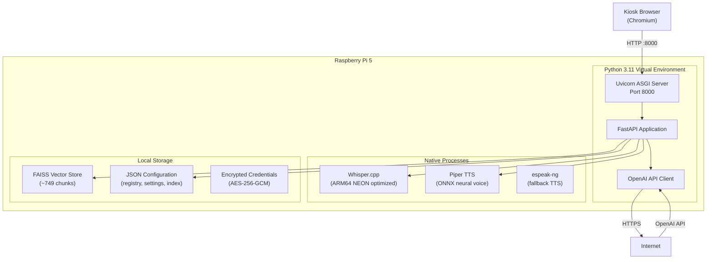
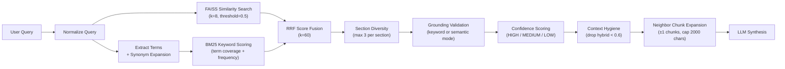
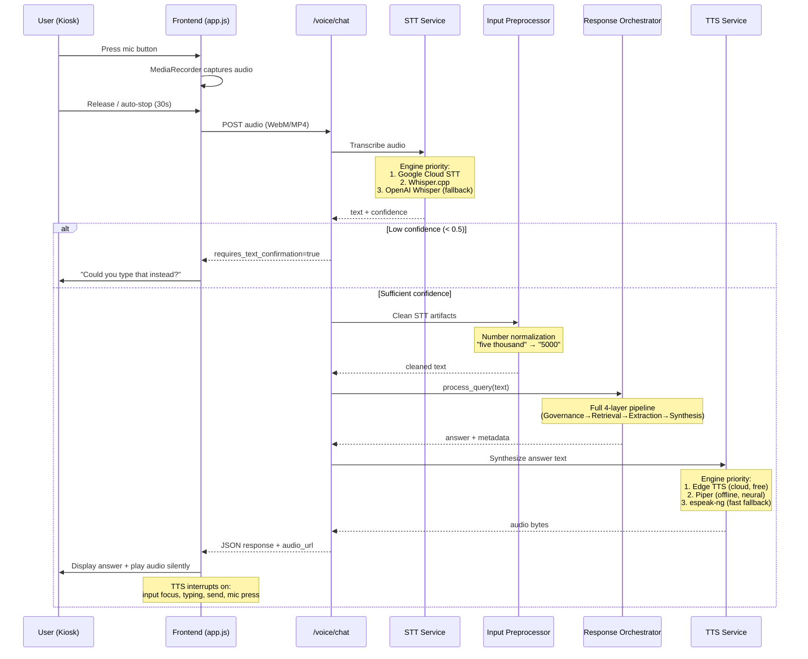

# Architecture Overview
This document serves as a critical, living reference designed to equip developers with a rapid and comprehensive understanding of the CoCo codebase's architecture, enabling efficient navigation and effective contribution. Update this document as the codebase evolves.

## 1. Project Structure
This section provides a high-level overview of the project's directory and file structure, categorised by architectural layer or major functional area.

```
vibecoding_coco/                        # Repository root
├── campus_rag_chatbot/                 # Core application package
│   ├── app.py                          # FastAPI server — primary entrypoint, routing, session mgmt
│   ├── main.py                         # Standalone RAG demo / evaluation harness
│   ├── response_orchestrator.py        # 4-layer response orchestration (Governance → Retrieval → Extraction → LLM)
│   ├── document_manager.py            # Document ingestion pipeline, chunking, metadata validation
│   ├── retrieval_validator.py         # Hybrid retrieval scoring, grounding validation, synonym expansion
│   ├── confidence_scorer.py           # Confidence scoring (HIGH / MEDIUM / LOW)
│   ├── intent_classifier.py           # Query intent classification (campus / general / directory)
│   ├── query_analyzer.py              # Response style policy (query type & complexity detection)
│   ├── input_preprocessor.py          # STT artifact cleanup, number normalization
│   ├── math_engine.py                 # Deterministic arithmetic evaluation (AST-based)
│   ├── response_formatter.py          # Structured answer formatting for kiosk UI
│   ├── text_normalizer.py             # Text normalization utilities (NFKC, whitespace, etc.)
│   ├── text_normalizer_pipeline.py    # Multi-stage text normalization (5-stage PDF cleanup)
│   ├── entity_registry.py             # Directory entity definitions & CRUD operations
│   ├── entity_resolver.py             # Entity resolution pipeline for directory queries
│   ├── entity_analyzer.py             # Entity analysis utilities
│   ├── consolidation_engine.py        # Config-driven chunk consolidation framework
│   ├── metadata_index.py              # O(1) chunk lookups by metadata fields
│   ├── event_tracker.py               # Observability: structured event logging & analytics
│   ├── query_logger.py                # Query logging for analytics
│   ├── credential_manager.py          # Secure encrypted credential storage (AES-256-GCM)
│   ├── advertisement_manager.py       # Advertisement content management
│   ├── admin.py                       # CLI admin interface
│   ├── voice_routes.py                # Voice API endpoints (FastAPI router)
│   ├── voice/                          # Voice integration package
│   │   ├── __init__.py                # Package exports
│   │   ├── config.py                  # Voice configuration management
│   │   ├── audio_utils.py             # Audio format conversion & validation
│   │   ├── stt_service.py             # Speech-to-Text service with automatic fallback
│   │   ├── tts_service.py             # Text-to-Speech service with text optimization
│   │   ├── voice_orchestrator.py      # STT → Chat → TTS coordination
│   │   ├── provider_registry.py       # STT/TTS provider registration & config
│   │   ├── usage_tracker.py           # Google STT usage quota tracking
│   │   └── engines/                    # Engine implementations
│   │       ├── whisper_cpp.py         # Offline STT (Whisper.cpp, ARM64 optimized)
│   │       ├── whisper_openai.py      # Cloud STT fallback (OpenAI Whisper API)
│   │       ├── google_cloud_stt.py    # Cloud STT (Google Cloud Speech-to-Text)
│   │       ├── piper_tts.py           # Offline TTS (Piper neural voice)
│   │       └── edge_tts.py            # Cloud TTS (Microsoft Edge TTS, free)
│   ├── entity_extractors/             # Deterministic extractors (bypass LLM)
│   │   ├── __init__.py                # Extractor exports
│   │   ├── deans.py                   # Dean enumeration extraction
│   │   ├── awards.py                  # Awards enumeration extraction
│   │   ├── dates.py                   # Event date/time extraction
│   │   └── contacts.py               # Office contact extraction
│   ├── static/                         # Web frontend (served by FastAPI)
│   │   ├── index.html                 # User-facing chat interface
│   │   ├── style.css                  # Chat UI styles
│   │   ├── app.js                     # Chat UI logic, voice UI, debug panel
│   │   ├── admin.html                 # Admin interface (sidebar layout)
│   │   ├── admin.css                  # Admin UI styles
│   │   ├── admin.js                   # Admin logic (docs, entities, voice config, analytics)
│   │   ├── login.html                 # Admin login page
│   │   └── login.css                  # Login page styles
│   ├── data/                           # Runtime data files
│   │   ├── consolidation_rules.json   # Declarative consolidation rules
│   │   ├── metadata_index.json        # Pre-built metadata index (auto-generated)
│   │   ├── voice_settings.json        # Persisted voice provider configuration
│   │   ├── debug_settings.json        # Debug panel visibility settings
│   │   ├── credentials.enc            # Encrypted credentials store (AES-256-GCM)
│   │   ├── stt_usage.json             # Google STT quota tracking data
│   │   ├── advertisement_registry.json # Advertisement metadata
│   │   └── advertisements/            # Advertisement media files
│   ├── documents_to_ingest/           # Source documents for ingestion
│   ├── vector_store/                   # FAISS vector database (index.faiss + index.pkl)
│   ├── document_registry.json         # Ingested document metadata registry
│   ├── requirements.txt               # Python dependencies (Python 3.13)
│   ├── requirements_py311.txt         # Python dependencies (Python 3.11, recommended)
│   ├── requirements_rpi.txt           # Python dependencies (Raspberry Pi ARM64)
│   └── .env                           # Environment variables (not committed)
├── whisper.cpp/                        # External: Whisper.cpp STT engine (compiled for ARM64)
├── pi-setup.sh                         # Raspberry Pi deployment setup script
├── download-voice-models.sh           # Voice model download script (STT/TTS)
├── download-voice-models.ps1          # Voice model download (Windows dev)
└── architecture.md                     # This document
```

## 2. High-Level System Diagram

The following diagram illustrates the system's major components and data flow:

```mermaid
graph TB
    subgraph "Client Layer"
        USER["User (Kiosk / Browser)"]
    end

    subgraph "Input Modality"
        TEXT_IN["Text Input (POST /chat)"]
        VOICE_IN["Voice Input (POST /voice/chat)"]
    end

    subgraph "Voice Modality Layer"
        STT["STT Service<br/>(Whisper.cpp / Google Cloud)"]
        TTS["TTS Service<br/>(Piper / Edge TTS)"]
    end

    subgraph "Application Layer — app.py (FastAPI)"
        ROUTER["Request Router"]
        SESSION["Session Manager"]
        ADMIN["Admin API"]
    end

    subgraph "Orchestration Layer"
        ORCHESTRATOR["Response Orchestrator<br/>(4-Layer Architecture)"]
        GOVERNANCE["1. Governance<br/>(Intent, Safety, Authority)"]
        RETRIEVAL["2. Retrieval<br/>(Hybrid FAISS + BM25)"]
        EXTRACTION["3. Extraction<br/>(Deterministic Extractors)"]
        SYNTHESIS["4. LLM Synthesis<br/>(OpenAI gpt-4o-mini)"]
    end

    subgraph "Domain Layer"
        INTENT["Intent Classifier"]
        ENTITY["Entity Registry<br/>(Directory System)"]
        CONFIDENCE["Confidence Scorer"]
        GROUNDING["Grounding Validator"]
        EXTRACTORS["Deterministic Extractors<br/>(Deans, Awards, Dates, Contacts)"]
        MATH["Math Engine"]
    end

    subgraph "Infrastructure Layer"
        FAISS["FAISS Vector Store"]
        EMBEDDINGS["OpenAI Embeddings"]
        LLM["OpenAI LLM<br/>(gpt-4o-mini)"]
        DOCMGR["Document Manager<br/>(Ingestion Pipeline)"]
        METAIDX["Metadata Index<br/>(O&#40;1&#41; Lookups)"]
        CONSOLIDATION["Consolidation Engine"]
    end

    subgraph "Data Layer"
        DOCS["Source Documents<br/>(.pdf, .txt, .docx)"]
        VSTORE["vector_store/<br/>(index.faiss + index.pkl)"]
        REGISTRY["document_registry.json"]
        VOICEMOD["Voice Models<br/>(Whisper, Piper)"]
    end

    USER --> TEXT_IN
    USER --> VOICE_IN
    VOICE_IN --> STT
    STT --> ROUTER
    TEXT_IN --> ROUTER
    ROUTER --> SESSION
    ROUTER --> ORCHESTRATOR
    ORCHESTRATOR --> GOVERNANCE
    GOVERNANCE --> INTENT
    GOVERNANCE --> RETRIEVAL
    RETRIEVAL --> FAISS
    RETRIEVAL --> GROUNDING
    RETRIEVAL --> CONFIDENCE
    GOVERNANCE --> EXTRACTION
    EXTRACTION --> EXTRACTORS
    EXTRACTION --> MATH
    GOVERNANCE --> SYNTHESIS
    SYNTHESIS --> LLM

    ORCHESTRATOR -->|"Response Text"| TTS
    TTS -->|"Audio"| USER
    ORCHESTRATOR -->|"JSON Response"| USER

    DOCMGR --> EMBEDDINGS
    DOCMGR --> CONSOLIDATION
    DOCMGR --> VSTORE
    DOCMGR --> METAIDX
    DOCS --> DOCMGR

    FAISS --> VSTORE
    METAIDX --> VSTORE
    ENTITY -.-> ROUTER
    ADMIN --> DOCMGR
    ADMIN --> ENTITY
```



### Request Flow Summary

1. **Input** — Text via `POST /chat` or audio via `POST /voice/chat`
2. **Voice preprocessing** — Audio is transcribed by STT; STT artifacts are cleaned by `input_preprocessor`
3. **Governance** — Intent classification, safety checks, directory detection
4. **Retrieval** — FAISS similarity search (k=8) + BM25 keyword scoring → RRF hybrid ranking → grounding validation → confidence scoring → neighbor chunk expansion
5. **Extraction** — Deterministic extractors checked first (deans, awards, dates, contacts, math)
6. **Synthesis** — LLM generates the final natural-language response using validated context
7. **Output** — Structured JSON response to frontend; optionally TTS synthesis for voice output

## 3. Core Components

### 3.1. Frontend

**Name:** CoCo Kiosk Web Application

**Description:** A static single-page web application served directly by FastAPI. Provides a touch-friendly chat interface for kiosk deployment, an admin dashboard for content and voice management, and a login page for admin authentication. The chat UI supports both text and voice input with real-time audio visualization, confidence badges, mode indicators, source citations, and an optional debug panel. The admin UI uses a sidebar-based layout with sections for analytics, document upload, entity management, voice provider configuration, and credential management.

**Technologies:** HTML5, CSS3, Vanilla JavaScript, MediaRecorder API, Fullscreen API

**Deployment:** Served as static files by Uvicorn/FastAPI on the same origin (`/`, `/admin`, `/login`)

**Key Pages:**
| Page | File | Purpose |
|------|------|---------|
| Chat Interface | `index.html` + `app.js` + `style.css` | User-facing kiosk chat with voice |
| Admin Dashboard | `admin.html` + `admin.js` + `admin.css` | Content management, analytics, voice config |
| Admin Login | `login.html` + `login.css` | Password-based admin authentication |

### 3.2. Backend Services

#### 3.2.1. FastAPI Application Server

**Name:** CoCo Application Server

**Description:** The primary entrypoint (`app.py`) is a monolithic FastAPI application that handles all HTTP routing, session management, chat processing, admin operations, and voice API integration. It initializes all subsystems at startup (LLM, vector store, metadata index, voice services, credential manager) and coordinates the full request lifecycle.

**Technologies:** Python 3.11, FastAPI, Uvicorn (ASGI), Pydantic v2, LangChain, OpenAI API

**Deployment:** Single-process Uvicorn server on Raspberry Pi OS, port 8000

**Key Endpoints:**

| Endpoint | Method | Description |
|----------|--------|-------------|
| `/chat` | POST | Submit text query, receive structured answer |
| `/chat/stream` | POST | Server-Sent Events streaming responses |
| `/feedback` | POST | User feedback submission |
| `/reset` | POST | Reset conversation session |
| `/health` | GET | Application health check |
| `/admin/login` | POST | Admin authentication |
| `/admin/analytics` | GET | Analytics dashboard data |
| `/admin/upload` | POST | Document upload & ingestion |
| `/admin/documents` | GET | List ingested documents |
| `/admin/documents/{id}` | DELETE | Remove document from vector store |
| `/admin/entities` | GET/POST | Entity CRUD operations |
| `/admin/entities/csv` | GET/POST | CSV import/export of entities |
| `/admin/voice/config` | GET/PUT | Voice provider configuration |
| `/admin/voice/usage` | GET | STT usage quota data |
| `/admin/voice/credentials/status` | GET | Credential configuration status |
| `/admin/voice/credentials` | POST | Save encrypted credentials |

#### 3.2.2. Voice Modality Layer

**Name:** Voice Integration Service

**Description:** A modular voice subsystem that adds speech input/output as a modality layer on top of the existing chat pipeline. Handles audio → text transcription (STT), text → audio synthesis (TTS), and a combined voice chat flow. All RAG guarantees (grounding, confidence, determinism) are preserved — voice is strictly a modality layer, not a decision layer.

**Technologies:** Python asyncio, Whisper.cpp (via pywhispercpp), Piper TTS, Edge TTS, Google Cloud Speech-to-Text, pydub

**Deployment:** Initialized within the FastAPI server process; voice models downloaded separately

**Key Endpoints (under `/voice/` prefix):**

| Endpoint | Method | Description |
|----------|--------|-------------|
| `/voice/status` | GET | Voice service availability |
| `/voice/health` | GET | Detailed component health |
| `/voice/transcribe` | POST | Audio → text transcription |
| `/voice/synthesize` | POST | Text → audio synthesis |
| `/voice/chat` | POST | Full voice interaction (STT → Chat → TTS) |
| `/voice/stream` | WebSocket | Streaming transcription |
| `/voice/audio/{id}` | GET | Retrieve synthesized audio |

#### 3.2.3. Response Orchestrator

**Name:** LLM-as-Final-Synthesizer Orchestrator

**Description:** Implements a 4-layer architecture where all response paths terminate in the LLM for natural language generation. This ensures consistent, voice-friendly output regardless of whether the data came from deterministic extractors, RAG retrieval, or general knowledge.

**Technologies:** Python, LangChain, OpenAI Chat API

**Architecture Layers:**


| Layer | Responsibility | Key Module |
|-------|---------------|------------|
| **Governance** | Intent classification, safety checks, authority requirements | `intent_classifier.py` |
| **Retrieval** | Hybrid search, grounding validation, confidence scoring | `retrieval_validator.py`, `confidence_scorer.py` |
| **Extraction** | Deterministic data extraction (deans, awards, dates, math) | `entity_extractors/`, `math_engine.py` |
| **Synthesis** | LLM-based natural language generation from validated context | `response_orchestrator.py` |

**Response Modes:**
- `EXTRACTOR_AUTHORITATIVE` — Deterministic data passed to LLM for formatting
- `RAG_AUTHORITATIVE` — High-confidence retrieval context for LLM synthesis
- `RAG_SUPPLEMENTED` — Medium-confidence retrieval with caveats
- `GENERAL_KNOWLEDGE` — LLM answers without document context (non-campus queries)

## 4. Data Stores

### 4.1. FAISS Vector Store

**Name:** Document Embedding Store

**Type:** FAISS (Facebook AI Similarity Search) — local, file-persisted

**Purpose:** Stores OpenAI text embeddings (dimension 1536) for all ingested document chunks. Supports cosine similarity search for semantic retrieval with `k=8`.

**Key Files:**
- `vector_store/index.faiss` — FAISS index (binary, serialized)
- `vector_store/index.pkl` — LangChain docstore (chunk text + metadata)

**Assumption:** The vector store is pre-ingested on the development machine and deployed to the Raspberry Pi as pre-built files. The Pi does **not** run ingestion at runtime.

### 4.2. Document Registry

**Name:** Document Metadata Registry

**Type:** JSON file (`document_registry.json`)

**Purpose:** Tracks metadata for all ingested documents — file name, hash (SHA256 for deduplication), ingestion timestamp, chunk count, and file format.

### 4.3. Metadata Index

**Name:** Chunk Metadata Index

**Type:** JSON file (`data/metadata_index.json`, auto-generated)

**Purpose:** Provides O(1) lookups of chunks by `chunk_id`, `section`, `section_title`, `page`, and `document_id`— eliminating O(n) docstore iteration. Used for fast adjacent-chunk expansion and section-based queries.

### 4.4. Voice & Configuration Data

| File | Purpose |
|------|---------|
| `data/voice_settings.json` | Persisted STT/TTS provider selections and fallback config |
| `data/stt_usage.json` | Google Cloud STT monthly usage quota tracking |
| `data/credentials.enc` | AES-256-GCM encrypted API keys and service credentials |
| `data/consolidation_rules.json` | Declarative rules for chunk consolidation (deans, prayer) |
| `data/debug_settings.json` | Debug panel visibility toggle |
| `data/advertisement_registry.json` | Advertisement content metadata |

## 5. External Integrations / APIs

| Service | Purpose | Integration Method |
|---------|---------|-------------------|
| **OpenAI Chat API** | LLM inference (`gpt-4o-mini`) for intent classification, response synthesis, and general knowledge answers | REST API via `langchain-openai` SDK |
| **OpenAI Embeddings API** | Text embedding generation (dimension 1536) for document chunks during ingestion | REST API via `langchain-openai` SDK |
| **Google Cloud Speech-to-Text** | Cloud-based STT with higher accuracy; 60-minute/month free tier | gRPC via `google-cloud-speech` SDK |
| **Microsoft Edge TTS** | Free cloud TTS using Microsoft's neural voices; no API key required | HTTP via `edge-tts` package |

## 6. Deployment & Infrastructure

### Production Environment

**Target Platform:** Raspberry Pi 5 running Raspberry Pi OS (ARM64/aarch64)

**Runtime Architecture:**



**System Dependencies (Raspberry Pi OS):**
- `python3.11`, `python3.11-venv`, `python3.11-dev`
- `libmagic-dev` — file type detection
- `poppler-utils` — PDF processing
- `tesseract-ocr`, `tesseract-ocr-eng` — OCR for scanned PDFs
- `ffmpeg` — audio format conversion
- `espeak-ng`, `espeak-ng-data` — fallback TTS engine
- `libffi-dev`, `libssl-dev`, `libjpeg-dev`, `zlib1g-dev` — build dependencies

**Setup & Deployment:**

The deployment process is automated via `pi-setup.sh`, which:
1. Installs system-level packages via `apt`
2. Creates a Python 3.11 virtual environment
3. Installs Python dependencies from `requirements_rpi.txt`
4. Configures `.env` from template (API keys)
5. Optionally downloads voice models (~135 MB)
6. Verifies pre-ingested vector store presence
7. Runs a health-check smoke test

**Voice Model Downloads:** Handled by `download-voice-models.sh`:
- **STT:** `ggml-tiny.en.bin` (~75 MB) — Whisper.cpp model
- **TTS:** `en_US-amy-medium.onnx` + `.json` (~60 MB) — Piper neural voice

**Key Configuration Values:**

| Parameter | Value | Purpose |
|-----------|-------|---------|
| `RETRIEVAL_TOP_K` | 8 | Number of chunks retrieved per query |
| `RELEVANCE_SCORE_THRESHOLD` | 0.5 | Minimum vector similarity |
| `MIN_HYBRID_SCORE_FOR_CONTEXT` | 0.6 | Minimum hybrid score for inclusion |
| `RRF_K` | 60 | Reciprocal Rank Fusion smoothing constant |
| `HYBRID_SCORING_METHOD` | `"rrf"` | Industry-standard rank fusion |
| `SEMANTIC_SIMILARITY_THRESHOLD` | 0.75 | Semantic grounding override threshold |
| `MIN_SEMANTIC_CONTENT_LENGTH` | 300 | Min chars for semantic grounding |
| `MAX_CHUNKS_PER_SECTION` | 3 | Section diversity limit |
| `SESSION_TIMEOUT_MINUTES` | 30 | Chat session timeout |
| `ADMIN_SESSION_DURATION` | 8 hours | Admin session lifetime |

## 7. Security Considerations

**Authentication:**
- Admin access uses password-based authentication with session tokens
- Admin sessions stored in-memory with configurable expiry (8 hours)
- API key authentication for programmatic admin endpoints (`ADMIN_API_KEY`)

**Authorization:**
- Two-tier access: public (chat, feedback) and admin (document management, voice config, analytics)
- Admin routes protected by session token or API key validation

**Data Encryption:**
- **Credentials at rest:** AES-256-GCM encryption with PBKDF2 key derivation (100,000 iterations) from admin password
- **In transit:** HTTPS recommended for production (not enforced at application level)
- Atomic file writes for credential storage (temp file + rename for crash safety)
- Credentials never logged; status queries return metadata only (never raw values)

**Voice Security:**
- Rate limiting per endpoint: transcribe (30/min), synthesize (60/min), chat (20/min)
- Audio file validation with magic-byte format detection and size limits
- Input injection prevention in audio uploads
- Temporary audio storage with 5-minute TTL auto-expiry

**Key Security Practices:**
- Environment variables for all secrets (`.env` file, not committed)
- Google Cloud service account credentials stored encrypted, written to temp files only at runtime
- Privacy-by-design: personal phone/email not stored in contact extractors
- Observability events are privacy-safe (metadata only, no raw query text)

## 8. Architectural Deep Dives

### 8.1. RAG Architecture — Hybrid Retrieval

**RAG Type:** Hybrid RAG — combines dense vector retrieval with sparse keyword matching using Reciprocal Rank Fusion (RRF).



**Key Design Decisions:**
- **RRF over linear weighting:** Rank-based fusion is more robust to score distribution differences between vector and keyword methods
- **Query synonym expansion:** Domain-specific mappings (~40 bidirectional terms, e.g., `"cr"→"restroom"`, `"lib"→"library"`) improve recall for informal queries
- **Grounding validation:** Prevents semantic neighbor confusion (e.g., "Dean's List" returning "Team Leadership Award"). Two modes:
  - **Keyword mode:** Top chunks must contain query terms
  - **Semantic mode:** Override when similarity ≥ 0.75 AND content length ≥ 300 chars (for long-form content like hymns/prayers)
- **Single retrieval pipeline:** The LLM uses exactly the same chunks that were hybrid-ranked and validated — no hidden second retrieval
- **Entity confusion detection:** Known confusion pairs (e.g., `"dean's list"` vs `"deans"`) trigger specific refusal messages

### 8.2. Document Ingestion Pipeline

```mermaid
graph TB
    INPUT["Source Document<br/>(.pdf, .txt, .docx)"] --> LOAD["Load Document<br/>(Layout-aware PDF, PyPDF2, python-docx)"]
    LOAD --> CHUNK["Chunk with RecursiveCharacterTextSplitter<br/>(size=500, overlap=50)"]
    CHUNK --> APPENDIX{"Is Appendix?"}
    APPENDIX -->|"Yes"| LARGE_CHUNK["Larger max_size=2000"]
    APPENDIX -->|"No"| NORMAL_CHUNK["Standard max_size=500"]
    LARGE_CHUNK --> NORMALIZE
    NORMAL_CHUNK --> NORMALIZE["5-Stage Text Normalization<br/>(NFKC → hyphens → duplicates → whitespace → polish)"]
    NORMALIZE --> CONSOLIDATE["Consolidation Engine<br/>(config-driven synthetic chunks)"]
    CONSOLIDATE --> EMBED["Embed with OpenAI Embeddings"]
    EMBED --> FAISS_STORE["Store in FAISS"]
    FAISS_STORE --> VALIDATE["Metadata Validation<br/>(schema checks, stats logging)"]
    VALIDATE --> INDEX["Build Metadata Index<br/>(O&#40;1&#41; lookups)"]
    INDEX --> REG["Update Document Registry"]
```



**Consolidation Engine:** A config-driven framework (`consolidation_rules.json`) that creates synthetic chunks for structured content. Two pattern types:
- **Semantic pattern** — Clusters chunks matching required + anchor patterns (e.g., all dean entries → single synthetic chunk)
- **Anchor-continuation pattern** — Finds an anchor chunk then collects nearby continuation chunks (e.g., prayer fragments → single prayer chunk)

### 8.3. STT → LLM → TTS Processing Flow



**Voice Provider Architecture:**

| Service | Primary Engine | Fallback Engine | Notes |
|---------|---------------|-----------------|-------|
| **STT** | Google Cloud STT | Whisper.cpp (offline) | Google has 60-min/month free tier with quota tracking |
| **TTS** | Edge TTS (cloud) | Piper (offline) | Edge TTS is free, no API key; Piper requires Python 3.11 |

Provider selection is admin-configurable at runtime via the admin UI. Providers have selectability rules (paid/free, operational status) and explicit fallback selection.

### 8.4. Model Provider Abstraction

The `voice/` package implements a provider registry pattern that abstracts away specific STT/TTS engine implementations:

- **`ProviderRegistry`** — Maintains a catalog of available providers with metadata (pricing tier, selectability, fallback eligibility, operational status)
- **`STTService`** — Selects the configured primary STT engine, falls back to secondary on failure
- **`TTSService`** — Selects the configured primary TTS engine, falls back to secondary on failure
- **`VoiceOrchestrator`** — Coordinates the STT → Chat → TTS pipeline, preserving all RAG guarantees

Provider configuration is persisted in `data/voice_settings.json` and can be changed at runtime via `PUT /admin/voice/config`.

## 9. Scalability Considerations

**Current Architecture Constraints:**
- Single-process, single-machine deployment (Raspberry Pi 5)
- In-memory session storage (sessions lost on restart)
- FAISS runs in-process (no separate vector DB service)
- All JSON data files are file-based (no database)

**Performance Characteristics:**
- FAISS similarity search: sub-millisecond for ~749 chunks
- Metadata index: O(1) chunk lookups (replaced O(n) docstore iteration)
- Hybrid scoring adds minimal overhead (BM25 is in-process, no external call)
- LLM API call is the primary latency bottleneck (~500ms–2s)

**Potential Scaling Paths (not currently implemented):**
- Session store could migrate to Redis for persistence and multi-process support
- FAISS index could be served by a dedicated vector database (e.g., Pinecone, Weaviate) for larger corpora
- Static frontend could be served by a reverse proxy (nginx) to offload from Uvicorn
- Rate limiting could move from in-memory to a distributed store

## 10. Known Limitations & Technical Debt

| Area | Limitation |
|------|-----------|
| **Session persistence** | In-memory sessions (Dict) do not survive server restarts |
| **Deprecated module** | `entity_consolidation.py` is deprecated; retained for backward compatibility wrappers only — `consolidation_engine.py` is the active replacement |
| **LLM dependency** | Intent classification uses an LLM call, adding latency to every query; a lightweight local classifier could reduce this |
| **Single-model embedding** | All embeddings use a single OpenAI model; model switching would require full re-ingestion |
| **Admin authentication** | Session-token authentication is basic; no RBAC, no multi-user support |
| **Voice model size** | Offline voice models (~135 MB) must be downloaded separately and are not included in the repository |
| **Python version** | Piper TTS requires Python 3.11 specifically; Python 3.13 breaks due to `espeakbridge` import issues |

## 11. Project Identification

**Project Name:** CoCo — Columban College Information Kiosk

**Repository URL:** https://github.com/Kiruzato/coco-kiosk

**Primary Contact/Team:** Columban College Development Team

**Date of Last Update:** 2026-02-17

## 12. Glossary / Acronyms

| Term | Definition |
|------|-----------|
| **RAG** | Retrieval-Augmented Generation — technique that grounds LLM responses in retrieved document content |
| **Hybrid RAG** | RAG combining dense (vector) and sparse (keyword/BM25) retrieval methods |
| **RRF** | Reciprocal Rank Fusion — score combination method based on rank position rather than raw scores |
| **FAISS** | Facebook AI Similarity Search — efficient library for dense vector similarity search |
| **BM25** | Best Matching 25 — probabilistic keyword relevance scoring algorithm |
| **STT** | Speech-to-Text — converting spoken audio to written text |
| **TTS** | Text-to-Speech — converting written text to spoken audio |
| **Grounding** | Validation that retrieved content actually answers the user's query (prevents hallucination) |
| **Confidence Scoring** | System that rates answer reliability as HIGH (≥0.75 avg + ≥0.80 max), MEDIUM (≥0.55), or LOW |
| **Deterministic Extractors** | Rule-based modules that extract structured data (deans, awards) without LLM, ensuring 100% accuracy |
| **Synthetic Chunk** | Machine-generated chunk consolidating fragmented content (e.g., all dean entries into one chunk) |
| **Semantic Override** | Grounding bypass for high-similarity, long-form content that lacks literal keyword matches |
| **Entity Registry** | Structured directory of campus locations with canonical names, aliases, and coordinates |
| **Piper** | Open-source neural TTS engine optimized for edge devices (ARM64) |
| **Whisper.cpp** | C++ port of OpenAI's Whisper model, optimized for CPU inference on ARM64 |
| **Edge TTS** | Microsoft's neural TTS API accessible through the `edge-tts` Python package (free, no key required) |
| **Kiosk Mode** | Full-screen, touch-friendly deployment mode for Raspberry Pi with attached display |
| **PBKDF2** | Password-Based Key Derivation Function 2 — used for deriving encryption keys from admin password |
| **AES-256-GCM** | Advanced Encryption Standard (256-bit) in Galois/Counter Mode — authenticated encryption for credentials |
