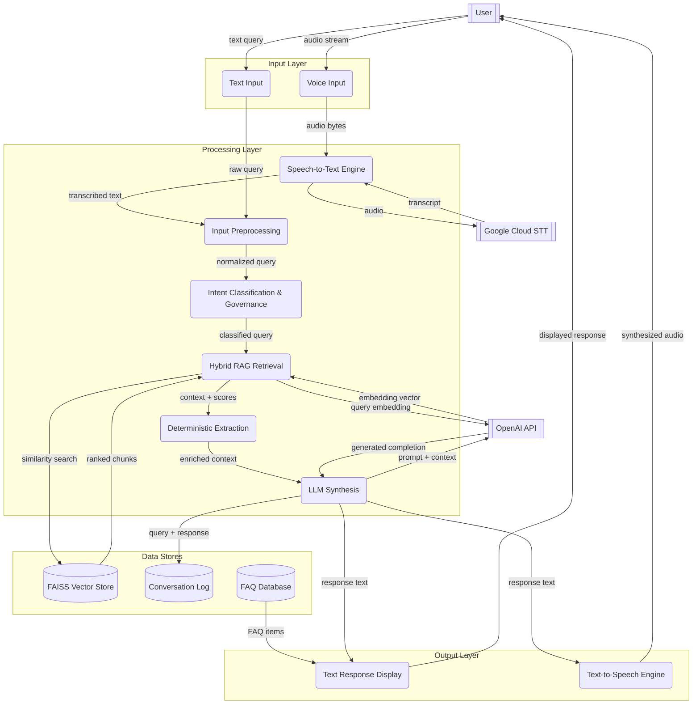

# CoCo System - Data Flow Diagram

End-to-end data flow for the CoCo Campus RAG Chatbot, covering both text and voice input paths through the processing pipeline to output and logging.

Derived from actual implementation in `WEB_APP`.

---

---

## Flow Description

### Input Paths

| Path | Entry | Flow |
|------|-------|------|
| **Text** | User types a query in the UI | Raw query passes directly to Input Preprocessing |
| **Voice** | User speaks into the microphone | Audio is sent to the STT engine, which calls Google Cloud STT for transcription, then the transcript passes to Input Preprocessing |

Both paths converge at **Input Preprocessing**, which normalizes the text (STT artifact cleanup, number normalization, whitespace cleanup).

### Processing Pipeline (4-Layer Architecture)

1. **Intent Classification & Governance** - Classifies the query intent (directory, academic, event, general, greeting, out-of-scope) and applies safety rules.

2. **Hybrid RAG Retrieval** - Embeds the query via OpenAI, runs FAISS vector similarity search (k=8), computes keyword term coverage scores, fuses results via linear weighted combination, then validates grounding and semantic relevance.

3. **Deterministic Extraction** - Attempts pattern-based extraction for structured queries (deans list, awards, event dates, office contacts). If matched, provides authoritative data that bypasses LLM guesswork.

4. **LLM Synthesis** - All response paths terminate here. Sends a prompt with retrieved context and/or extracted data to OpenAI GPT-4o-mini. Generates a natural language response.

### Data Store Interactions

| Store | Read By | Written By |
|-------|---------|------------|
| **FAISS Vector Store** | Hybrid RAG Retrieval (similarity search) | Not written at runtime (pre-built during ingestion) |
| **Conversation Log** | Admin analytics dashboard | LLM Synthesis (logs every query + response as JSONL) |
| **FAQ Database** | Frontend UI (loaded on page start) | Admin panel (CRUD operations) |

### Output Paths

| Path | Source | Destination |
|------|--------|-------------|
| **Text** | LLM response rendered in the chat UI | User reads on screen |
| **Voice** | LLM response passed to TTS engine (Piper or Edge TTS) | User hears audio playback |

### External Services

| Service | Used By | Data Exchanged |
|---------|---------|----------------|
| **OpenAI API** | Retrieval (query embedding) + LLM Synthesis (completion) | Query text, context prompt, generated response |
| **Google Cloud STT** | Speech-to-Text engine (voice input only) | Audio bytes sent, transcript returned. Data logging disabled at project level. |

---

## Notes

- **FAQ Database** feeds the UI independently of the chat pipeline. FAQs are loaded on page start via `/api/faqs` and displayed as clickable suggestions. They do not pass through the RAG pipeline.

- **Conversation Log** is append-only JSONL. Each entry contains `{query_id, timestamp, query, answer, feedback}`. Feedback is updated in-place when the user rates a response.

- **Voice path is a superset of text path.** The voice orchestrator runs STT, then delegates to the same chat pipeline used by text input, then runs TTS on the response. All RAG guarantees are preserved regardless of input modality.

- **Hybrid retrieval** combines FAISS vector similarity (70% weight) with custom keyword term coverage scoring (30% weight) via linear weighted fusion. This is not BM25 — it uses a custom `coverage_score = matched_terms / total_query_terms` formula.
