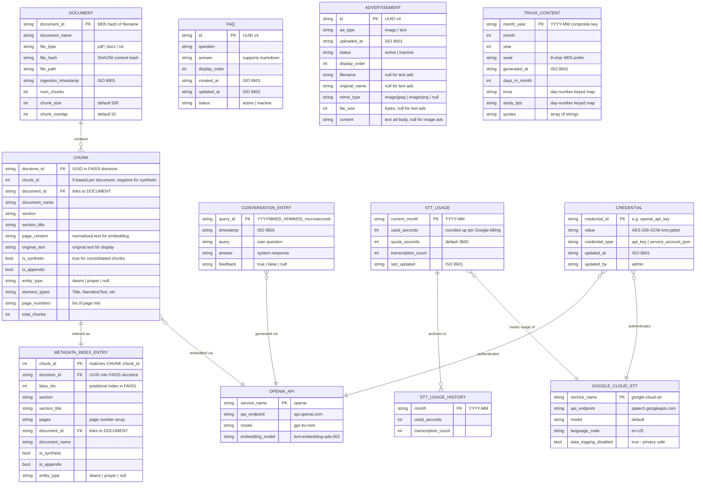

# CoCo System - Entity-Relationship Diagram

Entity-Relationship Diagram for the CoCo Campus RAG Chatbot system, covering both `WEB_APP` (runtime) and `INGESTION_MODULE` (document processing pipeline).

Only persistent, production-relevant entities are included. Runtime state, debug flags, and configuration-only data are excluded.

---

---

## Storage Formats

| Entity | File | Format | Location |
|--------|------|--------|----------|
| DOCUMENT | `document_registry.json` | JSON (keyed by document_id) | `modules/` |
| CHUNK | `index.faiss` + `index.pkl` | FAISS binary + Pickle | `modules/vector_store/` |
| METADATA_INDEX_ENTRY | `metadata_index.json` | JSON (5 secondary indexes) | `modules/data/` |
| CONVERSATION_ENTRY | `conversations.jsonl` | JSONL (one record per line) | `modules/logs/` |
| FAQ | `faq_data.json` | JSON (array under `faqs` key) | `modules/data/` |
| ADVERTISEMENT | `advertisement_registry.json` | JSON (array under `advertisements` key) | `modules/data/` |
| ADVERTISEMENT images | `ad_*.jpg/png` | Binary image files | `modules/data/advertisements/` |
| TRIVIA_CONTENT | `trivia_content.json` | JSON (regenerated monthly) | `modules/data/` |
| STT_USAGE | `stt_usage.json` | JSON (single record + history array) | `modules/data/` |
| CREDENTIAL | `credentials.enc` | AES-256-GCM encrypted binary | `modules/data/` |

## Notes

### Identifiers

- **DOCUMENT**: `document_id` is an MD5 hash of the filename. Duplicate detection uses `file_hash` (SHA256 of content).
- **CHUNK**: Each chunk has two IDs — `docstore_id` (UUID, internal to FAISS) and `chunk_id` (integer, sequential per document). Synthetic chunks use negative IDs (`-1` for deans, `-2` for prayer).
- **CONVERSATION_ENTRY**: `query_id` is a timestamp-based composite (`YYYYMMDD_HHMMSS_microseconds`), not a UUID. Feedback is stored inline as a nullable boolean.
- **METADATA_INDEX_ENTRY**: Provides O(1) lookups into the FAISS docstore via 5 secondary indexes (`by_chunk_id`, `by_section`, `by_section_title`, `by_page`, `by_document`).

### External Services

- **OPENAI_API**: Used for both LLM inference (GPT-4o-mini) and embedding generation (text-embedding-ada-002). All chunks are embedded through this service during ingestion.
- **GOOGLE_CLOUD_STT**: Speech-to-text with data logging disabled at the project level in Google Cloud Console. Usage tracked against a 60-minute monthly quota.
- **CREDENTIAL**: Stores API keys and service account JSON encrypted with AES-256-GCM, derived from the admin password via PBKDF2.

### Data Retention

- **CONVERSATION_ENTRY**: Retains current + previous calendar month; older entries archived.
- **STT_USAGE_HISTORY**: Retains last 12 months of archived usage.
- **TRIVIA_CONTENT**: Regenerated on the 1st of each month using a deterministic seed for LLM variation.

---

## Suggested Improvements

These are observations only — the ERD above reflects the current implementation.

1. **CONVERSATION_ENTRY lacks a session_id field**: Conversations are logged individually with no link back to the session that produced them. Adding `session_id` would enable session-level analytics (e.g., average turns per session, drop-off analysis).

2. **FAQ has no category/tag field**: All FAQs are in a flat list. A `category` field would support grouped display and filtered retrieval as the FAQ count grows.

3. **ADVERTISEMENT image storage is file-based**: Image files are stored on disk alongside JSON metadata. A `file_checksum` field would enable integrity validation and deduplication.
