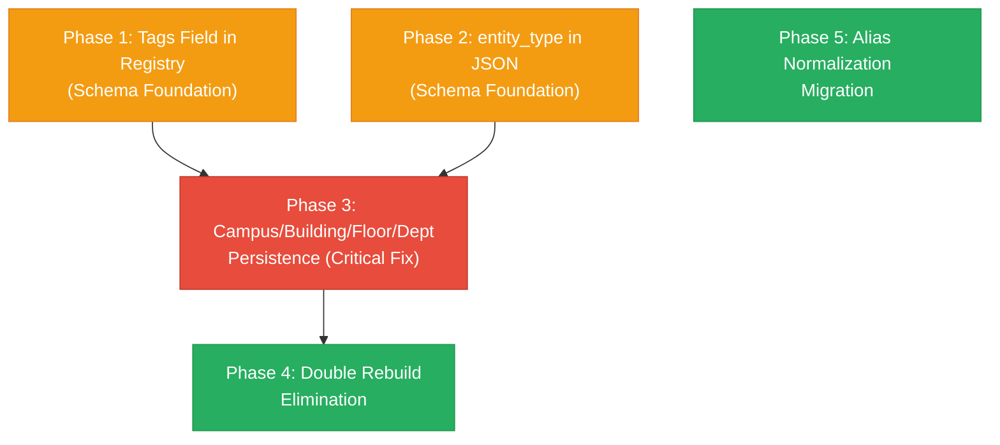

# CQE Architecture Remediation — Phased Implementation Plan

**Source:** [CQE Architecture Audit](file:///C:/Users/chann/.gemini/antigravity/brain/4dfe86e8-57b8-49f2-9da5-7eb31a12e5d9/cqe_architecture_audit.md)  
**Scope:** Convert 5 audit findings into an executable, phased roadmap  
**Approach:** No code changes here — this plan provides objectives, affected files, verification criteria, and phase dependencies for controlled execution

---

## Phase Dependency Map



> [!IMPORTANT]
> Phases 1 and 2 are **schema prerequisites** that must land before Phase 3. Phase 3 is the **critical integrity fix**. Phases 4 and 5 are independent improvements that can be done in any order after Phase 3.

---

## Phase 1 — Add `tags` Field to EntityRegistry

> **Priority:** High (prerequisite for Phase 3)  
> **Risk:** Low  
> **Audit Issue:** #3 — Tags not universally stored in JSON

### Objective

Add `tags: List[str]` to `DirectoryEntity` so that tags assigned via admin UI persist to `directory_entities.json` and survive restarts. Currently, tags exist only in the CQE index (inferred at build time) and are not round-tripped through the registry.

### Affected Files

| File | Change |
|---|---|
| [entity_registry.py](file:///c:/Users/chann/OneDrive/Desktop/restartcoco/vibecoding_coco/campus_rag_chatbot/entity_registry.py) | Add `tags: List[str] = field(default_factory=list)` to `DirectoryEntity` dataclass. Update `_load_entities()` to read `tags` from JSON. Update `save_entities()` to serialize `tags`. Update `add_entity()` and `update_entity()` to accept `tags` parameter. |
| [entity_manager.py](file:///c:/Users/chann/OneDrive/Desktop/restartcoco/vibecoding_coco/campus_rag_chatbot/entity_manager.py) | Update `validate_entity()` to pass `tags` through. Update `create_entity()` and `update_entity()` to forward `tags` to registry. |
| [campus_index.py](file:///c:/Users/chann/OneDrive/Desktop/restartcoco/vibecoding_coco/campus_rag_chatbot/campus_index.py) | No change needed — `_convert_flat_entity_to_room()` already reads `entity.get('tags', [])` from the raw JSON dict. |

### Acceptance Criteria

1. `DirectoryEntity` dataclass has a `tags` field
2. Creating an entity with `tags: ["lab", "science"]` via `EntityManager.create_entity()` persists tags to JSON
3. After restart (reload from JSON), the entity's tags are present in both the registry and the CQE index
4. Existing entities without `tags` in JSON default to `[]` — no migration breakage
5. CQE index tag inference continues working (inferred tags supplement explicit tags, not replace)

### Verification

```
# Automated: Run existing golden tests to confirm no regressions
cd c:\Users\chann\OneDrive\Desktop\restartcoco\vibecoding_coco\campus_rag_chatbot
python test_cqe_golden.py
python test_campus_query_engine.py
```

**New test to write:** A focused unit test that:
1. Creates an entity with explicit tags via `EntityRegistry.add_entity()`
2. Verifies the saved JSON contains the `tags` field
3. Re-loads the registry from the same JSON
4. Confirms tags survive the round-trip

---

## Phase 2 — Add `entity_type` Field to JSON Schema

> **Priority:** High (prerequisite for Phase 3)  
> **Risk:** Low  
> **Audit Issue:** #2 — `entity_type` not stored in JSON

### Objective

Add `entity_type` as a stored field in `directory_entities.json` (values: `"room"`, `"outdoor"`). This is a **forward-looking** schema change — today all entities are rooms or outdoor locations, but Phase 3 will add campus/building/floor/department as first-class JSON entities, and they will need an `entity_type` discriminator.

### Affected Files

| File | Change |
|---|---|
| [entity_registry.py](file:///c:/Users/chann/OneDrive/Desktop/restartcoco/vibecoding_coco/campus_rag_chatbot/entity_registry.py) | Add `entity_type: str = "room"` to `DirectoryEntity`. Read from JSON with fallback default based on `building == "_OUTDOOR"`. Write to JSON on save. |
| [campus_index.py](file:///c:/Users/chann/OneDrive/Desktop/restartcoco/vibecoding_coco/campus_rag_chatbot/campus_index.py) | Update `load_from_flat_entities()` to use `entity_type` field for outdoor detection instead of (or in addition to) `_OUTDOOR` marker check. Keep `_OUTDOOR` as fallback for backward compat. |

### Acceptance Criteria

1. Every entity in JSON has an `entity_type` field after save
2. Existing entities without `entity_type` are inferred correctly on load (`_OUTDOOR` → `"outdoor"`, else `"room"`)
3. CQE index builds identically before and after the change
4. No regression in query results

### Verification

```
# Automated: Existing tests
cd c:\Users\chann\OneDrive\Desktop\restartcoco\vibecoding_coco\campus_rag_chatbot
python test_cqe_golden.py
python test_campus_query_engine.py
```

**New test to write:** Verify that saving and reloading entities preserves `entity_type` values and that outdoor locations are correctly identified by both `entity_type` and `_OUTDOOR` fallback.

---

## Phase 3 — Campus/Building/Floor/Department JSON Persistence

> **Priority:** 🔴 Critical  
> **Risk:** High — touches the persistence pipeline for 4 entity types  
> **Audit Issue:** #1 — Admin CRUD for these entities bypasses JSON persistence  
> **Depends on:** Phase 1 (tags field), Phase 2 (entity_type field)

### Objective

Wire all Campus, Building, Floor, and Department admin CRUD endpoints through the `EntityRegistry` → `save_entities()` → `rebuild_cqe_index()` pipeline, eliminating the current pattern of direct in-memory CQE index mutation. After this phase, **all entity types survive restart**.

### Design Decision

> [!IMPORTANT]
> **Two approaches exist — recommend Approach A:**
>
> **A. Store as first-class entities in `directory_entities.json`** using the `entity_type` field from Phase 2 to discriminate. Campus entities would have `entity_type: "campus"`, buildings `entity_type: "building"`, etc. They share the same `entities[]` array.
>
> **B. Store in a separate section** (e.g., `"campuses": [...]`, `"buildings": [...]`). This would require restructuring the JSON file.
>
> Approach A is recommended because it requires less structural change, reuses the existing `EntityRegistry` save pipeline, and keeps the single `entities[]` array as the sole data source.

### Affected Files

| File | Change |
|---|---|
| [entity_registry.py](file:///c:/Users/chann/OneDrive/Desktop/restartcoco/vibecoding_coco/campus_rag_chatbot/entity_registry.py) | Expand `DirectoryEntity` to support non-room entity types. Add fields needed for campus/building/floor/department (e.g., `campus_id`, `building_id`, `floor_level`, `level_number`, `display_name`). These can be `Optional` and only populated for the relevant `entity_type`. Update `add_entity()` validation to handle different entity types. |
| [entity_manager.py](file:///c:/Users/chann/OneDrive/Desktop/restartcoco/vibecoding_coco/campus_rag_chatbot/entity_manager.py) | Add `create_campus()`, `create_building()`, `create_floor()`, `create_department()` methods (or generalize `create_entity()` to handle all types). Each must validate, save, and rebuild. |
| [campus_index.py](file:///c:/Users/chann/OneDrive/Desktop/restartcoco/vibecoding_coco/campus_rag_chatbot/campus_index.py) | Update `load_from_flat_entities()` to process `entity_type` values: `"campus"` → create Campus, `"building"` → create Building, `"floor"` → create Floor, `"department"` → create Department. Continue deriving these from room entities as well (for backward compatibility), but prefer explicit entities when both exist. |
| [app.py](file:///c:/Users/chann/OneDrive/Desktop/restartcoco/vibecoding_coco/campus_rag_chatbot/app.py) | **Rewrite all 8 non-persisting endpoints** (`create_cqe_campus`, `update_cqe_campus`, `create_cqe_building`, `update_cqe_building`, `create_cqe_floor`, `update_cqe_floor`, `create_cqe_department`, `update_cqe_department`) to flow through `EntityManager` → `EntityRegistry.save_entities()` → `rebuild_cqe_index()`. Remove direct index mutations. |
| [data/directory_entities.json](file:///c:/Users/chann/OneDrive/Desktop/restartcoco/vibecoding_coco/campus_rag_chatbot/data/directory_entities.json) | Schema version bump to `"1.2"`. After admin creates a campus/building/floor/department, it will appear as an entry in `entities[]` with the appropriate `entity_type`. |

### Acceptance Criteria

1. `POST /admin/cqe/campus` → entity saved to JSON with `entity_type: "campus"` → survives restart
2. `POST /admin/cqe/building` → entity saved to JSON with `entity_type: "building"` → survives restart
3. `POST /admin/cqe/floor` → entity saved to JSON with `entity_type: "floor"` → survives restart
4. `POST /admin/cqe/department` → entity saved to JSON with `entity_type: "department"` → survives restart
5. `PUT` endpoints for all four types also persist changes
6. `DELETE` endpoints still enforce existing deletion rules (campus=403, building/floor/dept=block if dependents)
7. CQE index after restart is identical to CQE index before restart (deterministic rebuild)
8. Existing room/outdoor entities unaffected
9. Deletion cascade still works (delete building → auto-delete floors when no rooms)

### Verification

```
# Automated: Existing tests must still pass
cd c:\Users\chann\OneDrive\Desktop\restartcoco\vibecoding_coco\campus_rag_chatbot
python test_cqe_golden.py
python test_campus_query_engine.py
```

**New test to write — Restart persistence test:**
1. Load the app / entity manager
2. Create a campus, building, floor, and department via `EntityManager`
3. Verify they appear in the CQE index
4. Simulate restart: create a new `EntityRegistry` + `CampusQueryIndex` from the same JSON file
5. Verify all 4 entities are present in the new index
6. Update one entity, repeat restart check
7. Delete one entity (where allowed), repeat restart check

**Manual verification:**
1. Start the app (`python -m uvicorn app:app`)
2. Log into admin UI at `/admin/login`
3. Navigate to `/admin/cqe`
4. Create a new building via the UI
5. Restart the app (Ctrl+C → re-run)
6. Navigate back to `/admin/cqe` → confirm the building persists

---

## Phase 4 — Eliminate Double Index Rebuild

> **Priority:** Low (performance improvement)  
> **Risk:** Low  
> **Audit Issue:** #5 — Room/outdoor CRUD triggers two full index rebuilds  
> **Depends on:** Phase 3 (after Phase 3, all entity types use the same pipeline)

### Objective

Remove the redundant `rebuild_cqe_index()` call from `app.py` CRUD endpoints, since `EntityManager.create_entity()` / `update_entity()` / `delete_entity()` already call `self.rebuild_index()` internally.

### Affected Files

| File | Change |
|---|---|
| [app.py](file:///c:/Users/chann/OneDrive/Desktop/restartcoco/vibecoding_coco/campus_rag_chatbot/app.py) | Remove `rebuild_cqe_index()` calls from: `create_cqe_room` (L4977), `update_cqe_room` (L5034), `delete_cqe_room` (L5063), `create_cqe_outdoor_location` (L5145), `update_cqe_outdoor_location` (L5195), `delete_cqe_outdoor_location` (L5218), and any newly-wired campus/building/floor/department endpoints from Phase 3. |

### Acceptance Criteria

1. Each CRUD operation triggers exactly one index rebuild (inside `EntityManager`), not two
2. No change in functional behavior — queries return identical results
3. The explicit `POST /admin/cqe/rebuild` endpoint (`rebuild_cqe_index()` at L4190) is **kept** — it's an intentional manual rebuild trigger

### Verification

```
# Automated: Existing tests
cd c:\Users\chann\OneDrive\Desktop\restartcoco\vibecoding_coco\campus_rag_chatbot
python test_cqe_golden.py
python test_campus_query_engine.py
```

**New test to write:** Add logging assertions or a counter to verify exactly one rebuild occurs per CRUD call (optional — can also be verified via log inspection).

---

## Phase 5 — Alias Data Normalization

> **Priority:** Low (data quality improvement)  
> **Risk:** Very low — data migration only, no code logic changes  
> **Audit Issue:** #4 — Aliases format inconsistency  
> **Depends on:** None (independent, but best done after Phase 3 to batch with a JSON write)

### Objective

Normalize all alias entries in `directory_entities.json` from mixed formats (single comma-separated strings inside a list) to consistently proper arrays.

### Before / After

```diff
 {
   "entity_id": "CONF_ROOM_1",
-  "aliases": ["conference room, meeting room, board room"],
+  "aliases": ["conference room", "meeting room", "board room"],
   ...
 }
```

### Affected Files

| File | Change |
|---|---|
| [data/directory_entities.json](file:///c:/Users/chann/OneDrive/Desktop/restartcoco/vibecoding_coco/campus_rag_chatbot/data/directory_entities.json) | One-time migration: split all comma-separated alias strings into proper list items. |

### Implementation Notes

- Write a small migration script (not committed to production) that loads the JSON, normalizes aliases, and saves
- Alternatively, let the next `save_entities()` call normalize automatically if alias normalization is added to `EntityRegistry.add_entity()` / `update_entity()`
- The CQE index builder already handles both formats, so this is purely a data quality fix

### Acceptance Criteria

1. No alias entry in JSON contains commas (each alias is a separate list element)
2. All existing alias lookups still resolve correctly
3. CQE index alias count is identical before and after normalization

### Verification

```
# Automated: Existing tests
cd c:\Users\chann\OneDrive\Desktop\restartcoco\vibecoding_coco\campus_rag_chatbot
python test_cqe_golden.py
python test_campus_query_engine.py
```

**New test to write:** Compare the CQE index alias maps (room, building, campus, outdoor) before and after normalization — they should be byte-identical.

---

## Summary Table

| Phase | Issue | Priority | Risk | Depends On | Files Modified |
|---|---|---|---|---|---|
| **1** | Tags field in registry | High | Low | — | `entity_registry.py`, `entity_manager.py` |
| **2** | `entity_type` in JSON | High | Low | — | `entity_registry.py`, `campus_index.py` |
| **3** | Persistence for campus/building/floor/dept | 🔴 Critical | High | **1, 2** | `entity_registry.py`, `entity_manager.py`, `campus_index.py`, `app.py`, `directory_entities.json` |
| **4** | Double rebuild elimination | Low | Low | 3 | `app.py` |
| **5** | Alias normalization | Low | Very Low | — | `directory_entities.json` |

> [!NOTE]
> **Recommended execution order:** Phase 1 → Phase 2 → Phase 3 → Phase 4 → Phase 5.  
> Phases 1 and 2 can be done in parallel. Phase 5 is fully independent.  
> Each phase should be completed, tested, and committed before starting the next dependent phase.
