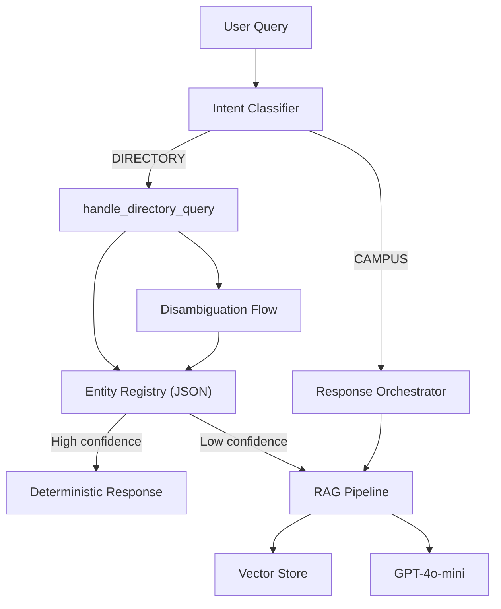
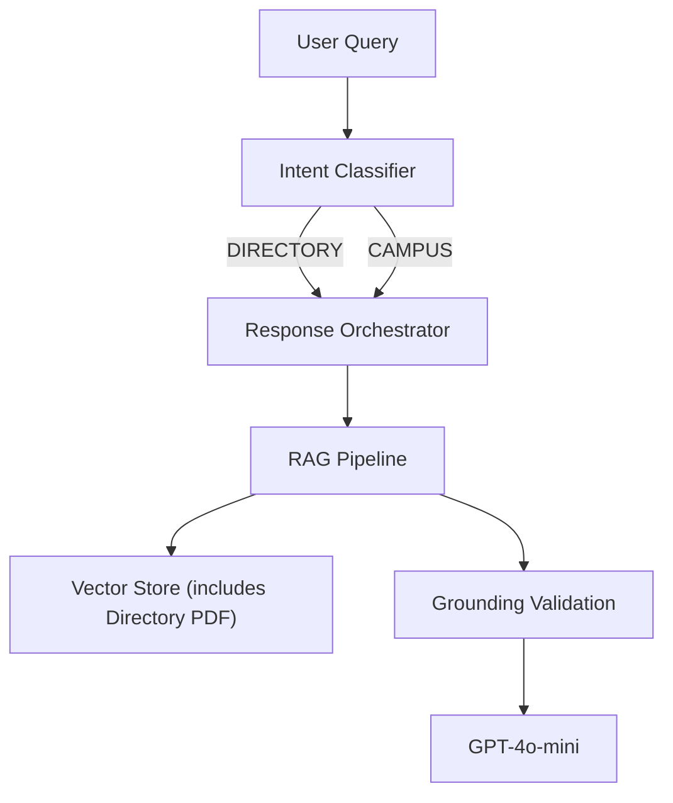

# Directory Entity System → RAG Document Migration Plan

## Goal

Replace the structured directory entity system with a retrieval-optimized PDF document, eliminating `EntityRegistry`, `entity_resolver`, `entity_analyzer`, all entity CRUD API routes, and the Admin UI entity management section. All directory information will be served through the unified RAG pipeline.

---

## 1. Architectural Impact Analysis

### Backend Module Dependencies

The directory entity system touches **4 core Python modules**, **1 main application file**, and **1 data file**:

| Module | Lines | Role | Impact |
|--------|-------|------|--------|
| [entity_registry.py](file:///c:/Users/chann/OneDrive/Desktop/restartcoco/vibecoding_coco/campus_rag_chatbot/entity_registry.py) | 658 | `DirectoryEntity` dataclass + `EntityRegistry` CRUD class | **DELETE entire file** |
| [entity_resolver.py](file:///c:/Users/chann/OneDrive/Desktop/restartcoco/vibecoding_coco/campus_rag_chatbot/entity_resolver.py) | 199 | `extract_subject()`, `resolve_entity()`, `format_entity_response()`, `canonicalize_directory_query()` | **DELETE entire file** |
| [entity_analyzer.py](file:///c:/Users/chann/OneDrive/Desktop/restartcoco/vibecoding_coco/campus_rag_chatbot/entity_analyzer.py) | 250 | `check_entity_agreement()`, `should_promote_confidence()` | **DELETE entire file** |
| [entity_consolidation.py](file:///c:/Users/chann/OneDrive/Desktop/restartcoco/vibecoding_coco/campus_rag_chatbot/entity_consolidation.py) | 322 | Already deprecated (superseded by `consolidation_engine.py`) | **DELETE entire file** |
| [directory_entities.json](file:///c:/Users/chann/OneDrive/Desktop/restartcoco/vibecoding_coco/campus_rag_chatbot/data/directory_entities.json) | 3529 | ~200+ entity records | **Archive, then DELETE** |

### app.py Dependencies (5118 lines, ~25+ reference sites)

| Section | Lines | What Uses Entities | Removal Action |
|---------|-------|-------------------|----------------|
| Imports | ~55-65 | `entity_registry`, `entity_resolver`, `entity_analyzer`, `is_directory_query` | Remove entity imports; keep `is_directory_query` (still useful for RAG routing) |
| Constants | ~121 | `MIN_CONFIDENCE_DIRECTORY = ConfidenceLevel.HIGH` | Remove (RAG pipeline handles confidence uniformly) |
| Initialization | ~290-292 | `EntityRegistry(str(ENTITY_REGISTRY_PATH))` | Remove initialization block |
| Models | ~458-487 | `EntityCreate`, `EntityUpdate` Pydantic models | Remove both models |
| Session context | ~503-524 | `last_entity_id`, `last_entity_name`, disambiguation state fields | Remove entity-specific context fields |
| `update_conversation_context()` | ~575-587 | Updates `entity_id`, `entity_name` in session | Remove entity fields (keep intent/campus) |
| Follow-up handler | ~2644-2700 | `entity_registry.get_by_id(context["last_entity_id"])` | Remove entity-based follow-up (RAG will handle) |
| `handle_entity_disambiguation()` | ~1960-2029 | Full entity disambiguation flow | **DELETE entire function** |
| `handle_disambiguation_selection()` | ~2053-2172 | Entity selection from disambiguation | **DELETE entire function** |
| `handle_directory_query()` | ~2179-2450 | Entity-anchored resolution + RAG fallback | **Rewrite** → route directly to RAG pipeline |
| Disambiguation retry logic | ~2503-2577 | Chat endpoint disambiguation handling | Remove disambiguation branch |
| Entity CRUD API routes | ~4411-4725 | GET/POST/PUT/DELETE `/admin/entities/*`, export/import CSV | **DELETE all entity routes** (~315 lines) |

### response_orchestrator.py Dependencies

| Item | Lines | Impact |
|------|-------|--------|
| `GovernanceResult.is_directory_query` field | ~96 | Keep (still useful for RAG routing/prompt selection) |
| `_apply_governance()` calls `is_directory_query()` | ~577-596 | Keep (query classification is independent of entities) |

### intent_classifier.py Dependencies

| Item | Lines | Impact |
|------|-------|--------|
| `QueryIntent.DIRECTORY` enum value | ~enum definition | **Keep** — directory intent classification remains useful for RAG prompt specialization |
| `is_directory_query()` function | ~68-100 | **Keep** — regex-based detection feeds into RAG retrieval and governance |

### Entity Extractors Package

> [!NOTE]
> The `entity_extractors/` package (deans, awards, dates, contacts) is **NOT part of the directory entity system**. These are deterministic extractors that work on RAG-retrieved text. They are completely independent of `EntityRegistry` and should be **preserved unchanged**.

### consolidation_engine.py

> [!NOTE]
> `consolidation_engine.py` handles deans/prayer chunk consolidation during ingestion. It is **independent** of directory entities and should be **preserved unchanged**.

---

## 2. Directory PDF Design Plan

### Current State

An existing PDF exists at:
`documents_to_ingest/Columban_College_Barretto_Campus_Directory_RAG_Knowledge_Base.pdf` (176KB)

The current `directory_entities.json` contains ~200+ entities with structured fields: `entity_id`, `canonical_name`, `aliases`, `building`, `floor`, `room`, `campus`, `department`, `landmarks`, `description`.

### Retrieval-Optimized PDF Structure

The PDF should be reformatted to maximize RAG retrieval quality. Each entry should be a self-contained **natural language paragraph** that embeds all searchable terms inline.

#### Recommended Format Per Entry

```
## Canteen / Cafeteria

The Canteen (also known as the Cafeteria or dining hall) is located on the
Ground Floor of the St. Columban Building at the Barretto Campus. It is part
of the Student Services area. The canteen is near the main lobby and the
student lounge. It serves as the primary dining facility for students and staff.
```

**Key design principles:**

1. **Aliases embedded in text** — "also known as" phrasing ensures all aliases are in the same chunk
2. **Natural language** — full sentences maximize semantic embedding quality vs. tabular data
3. **Self-contained paragraphs** — each entry should be independently understandable after chunking
4. **Section headers** — H2 headers with primary name for structural chunking
5. **Consistent field ordering** — Name → Location → Building → Floor → Room → Department → Landmarks → Description
6. **Grouped by building** — entries organized by building for contextual proximity

#### Section Structure

```
# Columban College Barretto Campus Directory

## How to Use This Directory
[Brief intro explaining what information is available]

## St. Augustine Building
### Basic Education Conference Room
[paragraph with all details and aliases]

### Registrar's Office
[paragraph with all details and aliases]

## St. Columban Building
### Canteen / Cafeteria
[paragraph with all details and aliases]

...
```

#### Chunking Considerations

- Target chunk size: 300-500 tokens per entry
- Each entry should fit within a single chunk (no splitting mid-entry)
- Building grouping provides natural section boundaries
- Use clear H2/H3 headers for the layout-aware PDF parser (`unstructured`)

---

## 3. Migration Strategy (Phased)

### Phase A: PDF Creation & Parallel Ingestion
1. Generate the directory PDF from `directory_entities.json` data
2. Ingest the PDF into the vector store alongside existing documents
3. Test retrieval quality for directory queries against the RAG pipeline
4. **No code changes yet** — entity system still active as fallback

### Phase B: RAG-First with Entity Fallback
1. Modify `handle_directory_query()` to try RAG retrieval **first**
2. Only fall back to entity registry if RAG returns low confidence
3. Log comparison metrics (which path answered, confidence scores)
4. Validate that RAG answers match or exceed entity-based answers

### Phase C: Entity System Removal
1. Remove entity-based resolution from `handle_directory_query()`
2. Remove entity disambiguation flow
3. Remove entity follow-up context handling
4. Remove admin entity API routes and UI section
5. Delete entity module files
6. Archive `directory_entities.json`

### Phase D: Cleanup & Verification
1. Remove orphaned imports and constants
2. Run full test suite
3. Validate all directory query types against golden test set
4. Update architecture documentation

---

## 4. Directory Entity System Decommissioning Plan

### Files to DELETE

| File | Reason |
|------|--------|
| `entity_registry.py` | Entire module is entity CRUD |
| `entity_resolver.py` | Entity resolution logic |
| `entity_analyzer.py` | Entity agreement analysis |
| `entity_consolidation.py` | Already deprecated |
| `data/directory_entities.json` | Structured entity data (archive first) |

### Functions to DELETE from app.py

| Function | Lines |
|----------|-------|
| `handle_entity_disambiguation()` | ~1960-2029 |
| `handle_disambiguation_selection()` | ~2053-2172 |
| `normalize_stt_selection()` | ~2032-2050 |

### Functions to REWRITE in app.py

| Function | Change |
|----------|--------|
| `handle_directory_query()` | Remove entity-anchored resolution block (~2214-2300), keep RAG fallback as primary path |
| `create_session()` | Remove `last_entity_id`, `last_entity_name` from context; keep `last_intent`, `last_campus` |
| `update_conversation_context()` | Remove `entity_id`, `entity_name` parameters |
| Chat endpoint disambiguation section | Remove entire `awaiting_disambiguation` branch (~2503-2577) |
| Follow-up query handler | Remove entity-based follow-up (~2644-2700) |

### API Routes to DELETE from app.py

| Route | Method | Lines |
|-------|--------|-------|
| `/admin/entities` | GET | ~4415-4437 |
| `/admin/entities/export` | GET | ~4445-4497 |
| `/admin/entities/import` | POST | ~4500-4558 |
| `/admin/entities/{entity_id}` | GET | ~4561-4583 |
| `/admin/entities` | POST | ~4586-4625 |
| `/admin/entities/{entity_id}` | PUT | ~4628-4689 |
| `/admin/entities/{entity_id}` | DELETE | ~4692-4725 |

### Imports to REMOVE from app.py

```diff
-from entity_registry import EntityRegistry
-from entity_resolver import resolve_entity, extract_subject, format_entity_response, canonicalize_directory_query
-from entity_analyzer import check_entity_agreement, should_promote_confidence
```

### Constants to REMOVE from app.py

```diff
-MIN_CONFIDENCE_DIRECTORY = ConfidenceLevel.HIGH
-ENTITY_REGISTRY_PATH = PROJECT_ROOT / "data" / "directory_entities.json"
```

---

## 5. Admin UI Cleanup Plan

### admin.html Changes

| Section | Action |
|---------|--------|
| Entities tab in navigation | Remove tab button |
| Entities content section (table, empty state, loading) | Remove entire section |
| Entity add/edit modal | Remove modal HTML |
| References to "directory entities" in text | Remove |

### admin.js Changes

| Function/Section | Action |
|-----------------|--------|
| `loadEntities()` | DELETE |
| `showEntityModal()` | DELETE |
| `saveEntity()` | DELETE |
| `deleteEntity()` | DELETE |
| `exportEntities()` | DELETE |
| Entity table rendering logic | DELETE |
| Tab switching logic for entities | Simplify (remove entity tab case) |

---

## 6. Retrieval Accuracy Validation Plan

### Test Categories

| Category | Example Queries | Expected Behavior |
|----------|----------------|-------------------|
| **Exact name** | "Where is the canteen?" | High confidence, correct location |
| **Alias** | "Where is the cafeteria?" | High confidence via embedded alias |
| **Building-scoped** | "What's on the ground floor of St. Augustine?" | Returns multiple entries from that building/floor |
| **Department** | "Where is the Basic Education Department?" | Correct building and floor |
| **Landmark-based** | "What's near the main lobby?" | Returns entries with lobby landmarks |
| **Ambiguous** | "Where is the office?" | Returns best-matching entry or provides context from multiple |
| **Nonexistent** | "Where is the swimming pool?" | Low confidence rejection |
| **Follow-up** | "What floor?" (after asking about canteen) | RAG retrieval with conversation memory |

### Validation Method

1. Create a golden test set of 30-50 directory queries with expected answers
2. Run queries against the old entity system (capture baseline responses)
3. Run same queries against RAG-only pipeline (capture new responses)
4. Compare: confidence levels, answer accuracy, response latency
5. Accept migration only if RAG matches or exceeds entity answers on ≥90% of test cases

> [!IMPORTANT]
> The golden test set should be created BEFORE any code removal begins, using the existing entity system as the baseline for comparison.

### Automated Testing

Existing test files that may need updates:
- `test_cqe_golden.py` — references `is_directory_query` (backward compatibility test); will need update
- `test_campus_query_engine.py` — general query engine tests

### Manual Verification

After migration, the user should:
1. Start the server with `python -m uvicorn app:app --reload`
2. Open the chat UI and test 10+ directory queries covering the categories above
3. Verify the Admin UI no longer shows the Entities tab
4. Confirm no console errors or broken API calls

---

## 7. Risk Assessment and Mitigation

| Risk | Severity | Mitigation |
|------|----------|------------|
| **Retrieval degradation for aliases** | High | Embed all aliases inline in PDF paragraphs using "also known as" phrasing |
| **Chunking splits an entry** | Medium | Use ~300-500 token entries with clear section headers; validate chunk boundaries post-ingestion |
| **Loss of disambiguation UX** | Medium | RAG naturally handles ambiguity by returning top-ranked result; LLM can surface multiple options if retrieval returns close scores |
| **Follow-up query regression** | Medium | Conversation memory in the orchestrator preserves context; RAG re-retrieval handles follow-ups |
| **Admin loses entity editing** | Low | Directory updates now done by editing and re-ingesting the PDF. Document the new admin workflow. |
| **Performance impact** | Low | Entity lookups were O(1) hash-based; RAG retrieval is vector search (~100ms). Acceptable for kiosk use case. |
| **Ingestion quality** | Medium | Use layout-aware PDF parsing (`unstructured`) for better structure preservation; validate metadata post-ingestion |
| **Rollback difficulty** | Low | Archive `directory_entities.json` before deletion; entity modules can be restored from git history |

---

## 8. Post-Migration Architecture

### Before (Current)



### After (Post-Migration)



**Key simplifications:**
- **Single retrieval path** — all queries go through the same RAG pipeline
- **No entity registry** — directory data lives in the vector store as document chunks
- **No disambiguation flow** — the RAG + LLM combination handles ambiguity naturally
- **No special confidence rules** — unified confidence scoring for all query types
- **Fewer modules** — 4 entity-related Python files eliminated (~1,429 lines removed)
- **Simpler Admin UI** — no entity management section; directory updates via PDF re-ingestion

---

## Proposed Changes Summary

### [DELETE] Backend Entity Modules

#### [DELETE] [entity_registry.py](file:///c:/Users/chann/OneDrive/Desktop/restartcoco/vibecoding_coco/campus_rag_chatbot/entity_registry.py)
#### [DELETE] [entity_resolver.py](file:///c:/Users/chann/OneDrive/Desktop/restartcoco/vibecoding_coco/campus_rag_chatbot/entity_resolver.py)
#### [DELETE] [entity_analyzer.py](file:///c:/Users/chann/OneDrive/Desktop/restartcoco/vibecoding_coco/campus_rag_chatbot/entity_analyzer.py)
#### [DELETE] [entity_consolidation.py](file:///c:/Users/chann/OneDrive/Desktop/restartcoco/vibecoding_coco/campus_rag_chatbot/entity_consolidation.py)

---

### [ARCHIVE + DELETE] Entity Data

#### [DELETE] [directory_entities.json](file:///c:/Users/chann/OneDrive/Desktop/restartcoco/vibecoding_coco/campus_rag_chatbot/data/directory_entities.json)

---

### [MODIFY] Core Application

#### [MODIFY] [app.py](file:///c:/Users/chann/OneDrive/Desktop/restartcoco/vibecoding_coco/campus_rag_chatbot/app.py)
- Remove entity imports, initialization, models, functions, API routes, disambiguation logic, follow-up handling
- Rewrite `handle_directory_query()` to use RAG-only path

---

### [MODIFY] Admin UI

#### [MODIFY] [admin.html](file:///c:/Users/chann/OneDrive/Desktop/restartcoco/vibecoding_coco/campus_rag_chatbot/static/admin.html)
- Remove entities tab, table, modal

#### [MODIFY] [admin.js](file:///c:/Users/chann/OneDrive/Desktop/restartcoco/vibecoding_coco/campus_rag_chatbot/static/admin.js)
- Remove all entity management functions

---

### [NEW] Directory PDF

#### [NEW] Updated directory PDF in `documents_to_ingest/`
- Generated from `directory_entities.json` data
- Formatted for retrieval optimization

---

## Verification Plan

### Automated Tests
- **Command**: `cd c:\Users\chann\OneDrive\Desktop\restartcoco\vibecoding_coco\campus_rag_chatbot && python test_cqe_golden.py`
  - Verify `is_directory_query()` backward compatibility still passes (function is preserved)
  - Update any tests that reference `EntityRegistry` or entity resolution

### Manual Verification
1. **Server startup**: Run `cd c:\Users\chann\OneDrive\Desktop\restartcoco\vibecoding_coco\campus_rag_chatbot && python -m uvicorn app:app --reload` and confirm no import errors
2. **Directory queries**: Test "Where is the canteen?", "Where is the registrar?", "Where is the library?" in the chat UI
3. **Admin UI**: Navigate to admin panel and confirm no Entities tab is visible, no console errors
4. **Non-directory queries**: Test "Who are the deans?", "What are the library hours?" to confirm non-entity features still work
